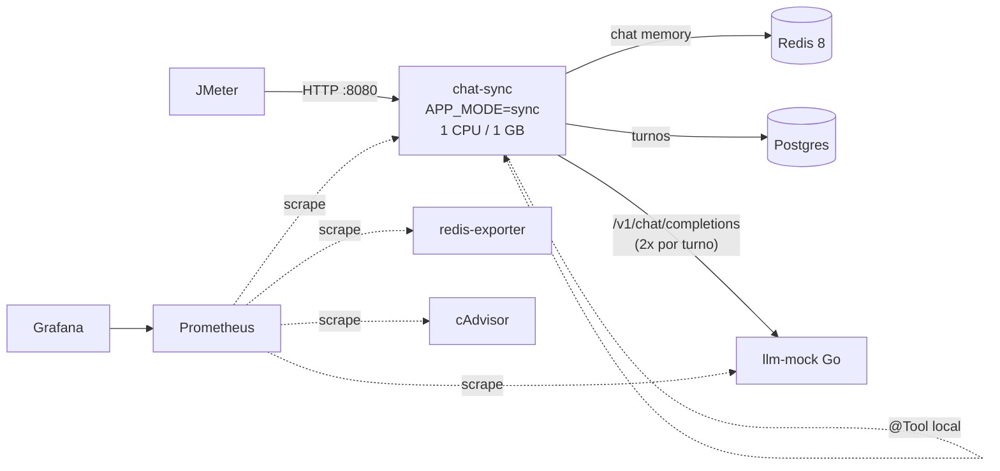
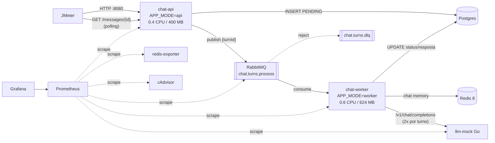
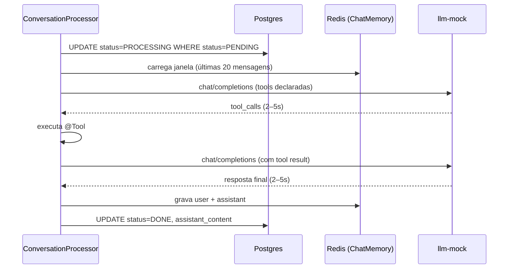

# BackendLLM

Alvo para estudar testes de performance (smoke, stress, spike) com JMeter: um chat com "IA"
em Spring Boot + Spring AI, em duas arquiteturas, com um LLM simulado em Go.

Cada mensagem gera **1 chamada LLM → 1 tool call → 1 chamada LLM**. O mock responde cada
chamada em 2–5s, então um turno leva de 4 a 10s.

## Arquiteturas

### Variante `sync` — tudo dentro da requisição HTTP



### Variante `queue` — API aceita, RabbitMQ enfileira, worker processa



### Um turno (igual nas duas variantes)



## Como rodar

Pré-requisito: Docker. Uma variante por vez — as duas expõem a API em `:8080`.

```bash
cd BackendLLM

# Variante 1
docker compose --profile sync up -d --build
docker compose --profile sync down

# Variante 2
docker compose --profile queue up -d --build
docker compose --profile queue down
```

| Serviço | URL |
|---|---|
| API | http://localhost:8080 |
| Grafana (dashboards na pasta **BackendLLM**) | http://localhost:3000 |
| Prometheus | http://localhost:9090 |
| RabbitMQ (guest/guest, só `queue`) | http://localhost:15672 |
| cAdvisor | http://localhost:8088 |
| llm-mock | http://localhost:9000 |

## Botões de ajuste (`.env`)

| Variável | Padrão | O que muda |
|---|---|---|
| `SYNC_CPUS` / `SYNC_MEM` | `1.0` / `1g` | Limites do `chat-sync` |
| `API_CPUS` / `API_MEM` | `0.4` / `400m` | Limites do `chat-api` |
| `WORKER_CPUS` / `WORKER_MEM` | `0.6` / `624m` | Limites do `chat-worker` |
| `WORKER_CONCURRENCY` | `50` | Turnos simultâneos no worker. Capacidade ≈ `WORKER_CONCURRENCY / 7s` turnos/s |
| `DB_POOL_SIZE` | `10` | Pool HikariCP |
| `REDIS_POOL_MAX` | `8` | Pool Jedis da memória de chat |
| `LLM_MIN_DELAY_MS` / `LLM_MAX_DELAY_MS` | `2000` / `5000` | Latência de cada chamada ao LLM |
| `LLM_ERROR_RATE` | `0.0` | Fração de chamadas LLM que falham (500/429) |

**Regra do orçamento:** na variante `queue`, `API_* + WORKER_*` deve somar no máximo 1 CPU e 1 GB.

Depois de mudar o `.env`: `docker compose --profile <variante> up -d` recria só o que mudou.

## API

| Método e rota | Resposta |
|---|---|
| `POST /conversations` | `201 {conversationId}` |
| `POST /conversations/{id}/messages` `{"content": "..."}` | `sync`: `200` com `status: DONE` (ou `FAILED`); `queue`: `202` com `status: PENDING` |
| `GET /messages/{id}` | status, resposta, erro e timestamps (lido do Postgres) |
| `GET /conversations/{id}/messages` | histórico completo da conversa (Postgres) |

Erros vêm como `application/problem+json`: `400` (conteúdo vazio ou > 4000 caracteres), `404`, `503` (fila indisponível).

## Roteiro manual com curl

```bash
CID=$(curl -s -X POST localhost:8080/conversations | jq -r .conversationId)

# Envia uma mensagem (sync: espera 4–10s e já volta DONE; queue: volta PENDING na hora)
MID=$(curl -s -X POST localhost:8080/conversations/$CID/messages \
  -H 'Content-Type: application/json' -d '{"content":"Recife"}' | tee /dev/tty | jq -r .messageId)

# Polling até terminar (é o que o JMeter faz)
until [ "$(curl -s localhost:8080/messages/$MID | jq -r .status)" = "DONE" ]; do printf .; sleep 1; done; echo
curl -s localhost:8080/messages/$MID | jq

# Histórico (a segunda mensagem mostra "mensagens no contexto" maior: memória no Redis)
curl -s -X POST localhost:8080/conversations/$CID/messages -H 'Content-Type: application/json' -d '{"content":"Natal"}' > /dev/null
curl -s localhost:8080/conversations/$CID/messages | jq
```

Direto no banco: `docker compose exec postgres psql -U chat -c "select status, count(*), avg(completed_at - started_at) as processamento, avg(started_at - created_at) as espera from chat_turns group by status;"`

## O que observar nos testes

- **Visão geral:** latência do POST (p95/p99), erros, turnos/s e trabalho em andamento.
- **Recursos:** CPU com *throttling* (o container batendo no teto), memória vs limite, heap/GC, HikariCP `esperando` e clientes Redis.
- **Fila:** backlog (`prontas`) crescendo num spike e drenando depois; tempo de espera na fila; DLQ.

Gargalos candidatos para investigar: CPU (1 core para tudo), `REDIS_POOL_MAX=8` com centenas de
turnos simultâneos, `DB_POOL_SIZE`, `WORKER_CONCURRENCY` e o próprio orçamento dividido entre API e worker.

## Limitações conhecidas

- No Docker Desktop para Mac, com a opção "Use containerd for pulling and storing images" **ligada**
  (Settings → General), o cAdvisor não enxerga os containers individualmente, e os painéis do
  dashboard **Recursos** referentes a CPU por container, CPU throttling e memória vs limite ficam
  vazios; desligue a opção e reinicie o Docker Desktop para vê-los preenchidos (no Linux funcionam
  sem ajuste). Os painéis de heap/GC/HikariCP (métricas da JVM) funcionam independentemente disso.
- As primeiras requisições logo após subir os containers Java podem levar ~30s (aquecimento da JVM
  sob o limite de CPU) — aqueça antes de medir.
- Limitações conhecidas do design: não há outbox (uma falha ao publicar depois do `INSERT` marca o
  turno como `FAILED` e retorna `503`); não há reaper (um worker morto no meio do processamento
  deixa o turno preso em `PROCESSING`).

## Testes automatizados

```bash
(cd llm-mock && go test ./...)
(cd chat-app && ./mvnw test)   # precisa do Docker (Testcontainers)
```
