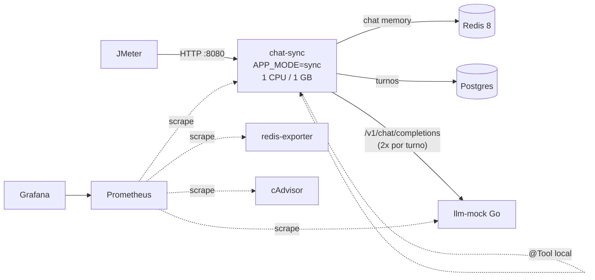
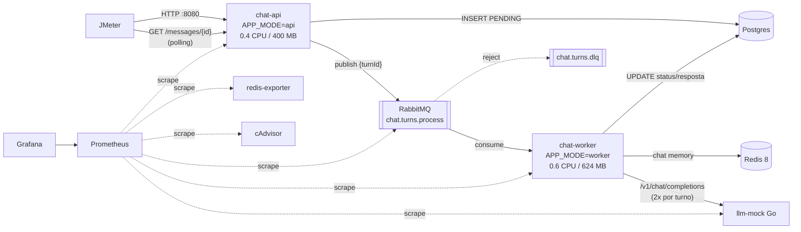
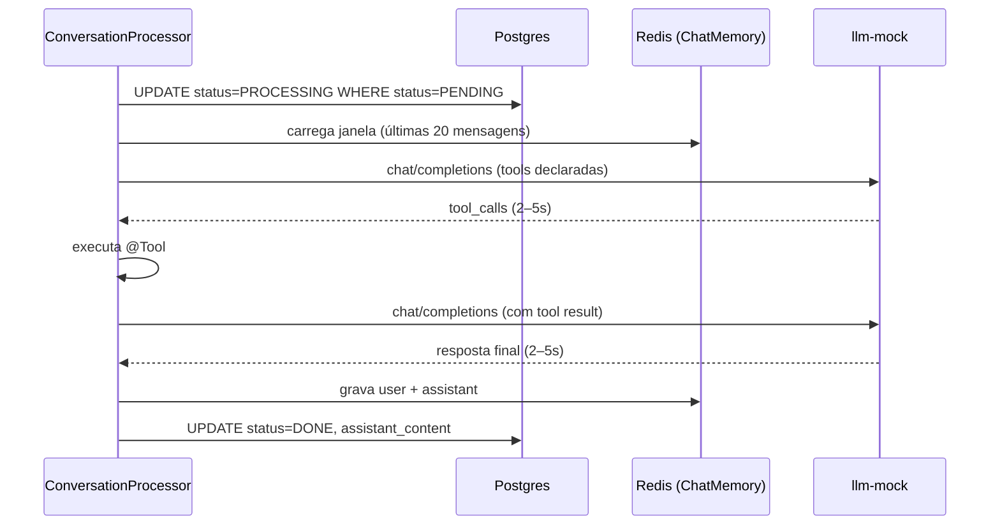

# BackendLLM Implementation Plan

> **For agentic workers:** REQUIRED SUB-SKILL: Use superpowers:subagent-driven-development (recommended) or superpowers:executing-plans to implement this plan task-by-task. Steps use checkbox (`- [ ]`) syntax for tracking.

**Goal:** Construir o alvo dos testes de performance: um mock de LLM em Go (compatível com a API OpenAI, 2–5s por chamada) e uma app Spring Boot de chat com IA que roda em duas variantes (`sync` e `queue` com RabbitMQ), com Postgres, Redis e observabilidade via Prometheus + Grafana, tudo num único Docker Compose.

**Architecture:** Um único jar Spring Boot cujo papel é definido por `APP_MODE` (`sync` | `api` | `worker`, mapeado para Spring profiles). O núcleo `ConversationProcessor` (memória Redis + Spring AI com LLM → `@Tool` → LLM + persistência Postgres) é idêntico nas duas variantes; só muda quem o chama (controller via `InlineTurnDispatcher`, ou listener RabbitMQ). O mock Go reage às tools declaradas pelo Spring AI para produzir sempre o fluxo tool call → resposta final.

**Tech Stack:** Go 1.27 + `prometheus/client_golang` v1.24.1; Java 25, Spring Boot 4.1.1, Spring AI 2.0.1, `JdbcClient` + Flyway, Spring AMQP, Micrometer Prometheus, Testcontainers 2.0.x; Postgres 17, Redis 8.6, RabbitMQ 4.3, Prometheus v3.9.1, Grafana 13.2.2, cAdvisor v0.60.6, redis_exporter v1.92.0.

**Spec:** `docs/superpowers/specs/2026-09-26-backend-llm-design.md`

## Global Constraints

- Todo o backend fica em `BackendLLM/`; um único `BackendLLM/docker-compose.yml`.
- Orçamento Java: `chat-sync` = 1 CPU / 1 GB; `chat-api` + `chat-worker` somam no máximo 1 CPU / 1 GB (padrão 0.4/400m + 0.6/624m), configurável no `.env`.
- Infra (Postgres, Redis, RabbitMQ, llm-mock, Prometheus, Grafana, exporters, cAdvisor) sem limite de recursos.
- Cada turno = exatamente 1 chamada LLM → 1 tool call → 1 chamada LLM.
- Mock LLM: delay uniforme `MIN_DELAY_MS=2000`..`MAX_DELAY_MS=5000`, `ERROR_RATE=0.0` por padrão.
- Memória de curto prazo: `spring-ai-starter-model-chat-memory-repository-redis`, janela de 20 mensagens, TTL 1h, `key-prefix=chat-memory:`.
- Nenhuma conexão HikariCP pode ficar retida durante chamadas ao LLM (sem `@Transactional` no caminho de processamento).
- Retry desligado por padrão: `spring.ai.retry.max-attempts=1` e `spring.ai.openai.max-retries=0`.
- Ambas as variantes expõem a API em `:8080` com o mesmo contrato; o `POST` de mensagem retorna 200 quando o turno já terminou (`DONE`/`FAILED`) e 202 caso contrário.
- Erros HTTP em `ProblemDetail` (RFC 9457). `content`: obrigatório, máx. 4000 caracteres.
- `spring.threads.virtual.enabled=true` em todos os modos.
- Prometheus com `scrape_interval: 5s`.
- Commits terminam com a linha `Co-Authored-By: Claude Opus 5.5 <noreply@anthropic.com>`.

## File Structure

```
BackendLLM/
├── docker-compose.yml                 # todos os serviços; profiles sync | queue          (Task 8)
├── .env                               # limites de recursos e botões de ajuste            (Task 8)
├── README.md                          # diagramas, como rodar, roteiro curl               (Task 10)
├── llm-mock/
│   ├── go.mod, go.sum                                                                     (Task 1)
│   ├── openai.go                      # tipos do protocolo OpenAI chat completions        (Task 1)
│   ├── responder.go                   # decisão tool_call / final / text                   (Task 1)
│   ├── responder_test.go                                                                  (Task 1)
│   ├── config.go, config_test.go      # config via env                                    (Task 2)
│   ├── server.go, server_test.go      # HTTP, delay, falhas, métricas                     (Task 2)
│   ├── main.go                                                                            (Task 2)
│   └── Dockerfile                                                                         (Task 2)
├── chat-app/
│   ├── pom.xml, mvnw, .mvn/                                                               (Task 3)
│   ├── Dockerfile, .dockerignore                                                          (Task 8)
│   └── src/
│       ├── main/java/dev/perf/chat/
│       │   ├── ChatApplication.java                                                       (Task 3)
│       │   ├── conversation/          # domínio, persistência, API HTTP
│       │   │   ├── TurnStatus.java, ChatTurn.java, DbTime.java                            (Task 3)
│       │   │   ├── ConversationRepository.java, ChatTurnRepository.java                   (Task 3)
│       │   │   ├── TurnDispatcher.java, NotFoundException.java                            (Task 5)
│       │   │   ├── ConversationService.java, ConversationController.java                  (Task 5)
│       │   │   └── SendMessageRequest.java, CreateConversationResponse.java, TurnResponse.java (Task 5)
│       │   ├── processing/            # núcleo compartilhado sync/worker
│       │   │   ├── RedisMemoryConfig.java, WeatherTools.java, ChatAssistant.java          (Task 4)
│       │   │   ├── ConversationProcessor.java                                             (Task 4)
│       │   │   └── InlineTurnDispatcher.java                                              (Task 5)
│       │   └── queue/                 # só variante queue
│       │       ├── RabbitTopology.java, RabbitTurnDispatcher.java                         (Task 7)
│       │       ├── DispatchFailedException.java, TurnListener.java                        (Task 7)
│       ├── main/resources/
│       │   ├── application.yml, application-sync.yml                                      (Task 3)
│       │   └── db/migration/V1__init.sql                                                  (Task 3)
│       └── test/java/dev/perf/chat/
│           ├── support/TestContainers.java                                                (Task 3)
│           ├── conversation/ChatTurnRepositoryTest.java                                   (Task 3)
│           ├── processing/WeatherToolsTest.java, ConversationProcessorTest.java           (Task 4)
│           ├── conversation/ConversationServiceTest.java, ConversationControllerTest.java (Task 5)
│           ├── SyncModeIntegrationTest.java                                               (Task 6)
│           ├── queue/RabbitTurnDispatcherTest.java                                        (Task 7)
│           └── QueueModeIntegrationTest.java                                              (Task 7)
└── observability/
    ├── prometheus/prometheus.yml                                                          (Task 8)
    ├── rabbitmq/enabled_plugins, rabbitmq/rabbitmq.conf                                   (Task 8)
    └── grafana/
        ├── provisioning/datasources/prometheus.yml                                        (Task 8)
        ├── provisioning/dashboards/dashboards.yml                                         (Task 9)
        └── dashboards/overview.json, resources.json, queue.json                           (Task 9)
```

Pré-requisitos na máquina: Go 1.27, Java 25, Docker Desktop rodando, `jq`. Não precisa de Maven instalado (usa `./mvnw`).

---

### Task 1: llm-mock — protocolo OpenAI e lógica de decisão

**Files:**
- Create: `BackendLLM/llm-mock/go.mod`
- Create: `BackendLLM/llm-mock/openai.go`
- Create: `BackendLLM/llm-mock/responder.go`
- Test: `BackendLLM/llm-mock/responder_test.go`

**Interfaces:**
- Consumes: nada.
- Produces:
  - Tipos `ChatRequest{Model string; Messages []Message; Tools []Tool}`, `Message{Role string; Content json.RawMessage; ToolCalls []ToolCall; ToolCallID string}`, `Tool{Type string; Function ToolFunction}`, `ToolFunction{Name, Description string; Parameters json.RawMessage}`, `ToolCall{ID, Type string; Function ToolCallFunction}`, `ToolCallFunction{Name, Arguments string}`, `ChatResponse`, `Choice`, `ResponseMessage`, `Usage`.
  - `type Kind string` com `KindToolCall="tool_call"`, `KindFinal="final"`, `KindText="text"`.
  - `func Respond(req ChatRequest, id string, now time.Time) (ChatResponse, Kind)`
  - `func argsFromSchema(schema json.RawMessage, userText string) string`
  - `func contentText(raw json.RawMessage) string`
  - Texto da resposta final contém `(mensagens no contexto: N)` — usado pelos testes de integração Java (Task 6) para provar a memória.

- [ ] **Step 1: Criar o módulo Go**

```bash
mkdir -p BackendLLM/llm-mock && cd BackendLLM/llm-mock
go mod init llmmock
go mod edit -go=1.27
```

- [ ] **Step 2: Escrever os tipos do protocolo**

`BackendLLM/llm-mock/openai.go`:

```go
package main

import (
	"encoding/json"
	"strings"
)

// Subset of the OpenAI chat completions API that Spring AI (openai-java SDK) uses.

type ChatRequest struct {
	Model    string    `json:"model"`
	Messages []Message `json:"messages"`
	Tools    []Tool    `json:"tools,omitempty"`
}

type Message struct {
	Role       string          `json:"role"`
	Content    json.RawMessage `json:"content,omitempty"` // string or array of content parts
	ToolCalls  []ToolCall      `json:"tool_calls,omitempty"`
	ToolCallID string          `json:"tool_call_id,omitempty"`
}

type Tool struct {
	Type     string       `json:"type"`
	Function ToolFunction `json:"function"`
}

type ToolFunction struct {
	Name        string          `json:"name"`
	Description string          `json:"description,omitempty"`
	Parameters  json.RawMessage `json:"parameters,omitempty"`
}

type ToolCall struct {
	ID       string           `json:"id"`
	Type     string           `json:"type"`
	Function ToolCallFunction `json:"function"`
}

type ToolCallFunction struct {
	Name      string `json:"name"`
	Arguments string `json:"arguments"` // JSON encoded as a string, as in the OpenAI API
}

type ChatResponse struct {
	ID      string   `json:"id"`
	Object  string   `json:"object"`
	Created int64    `json:"created"`
	Model   string   `json:"model"`
	Choices []Choice `json:"choices"`
	Usage   Usage    `json:"usage"`
}

type Choice struct {
	Index        int             `json:"index"`
	Message      ResponseMessage `json:"message"`
	FinishReason string          `json:"finish_reason"`
	Logprobs     *struct{}       `json:"logprobs"` // always null, but the key must be present
}

type ResponseMessage struct {
	Role      string     `json:"role"`
	Content   *string    `json:"content"` // null on tool calls
	Refusal   *string    `json:"refusal"` // always null, but the key must be present
	ToolCalls []ToolCall `json:"tool_calls,omitempty"`
}

type Usage struct {
	PromptTokens     int `json:"prompt_tokens"`
	CompletionTokens int `json:"completion_tokens"`
	TotalTokens      int `json:"total_tokens"`
}

// contentText flattens a message content that may be a plain string or an array of text parts.
func contentText(raw json.RawMessage) string {
	if len(raw) == 0 || string(raw) == "null" {
		return ""
	}
	var s string
	if json.Unmarshal(raw, &s) == nil {
		return s
	}
	var parts []struct {
		Type string `json:"type"`
		Text string `json:"text"`
	}
	if json.Unmarshal(raw, &parts) == nil {
		var b strings.Builder
		for _, p := range parts {
			b.WriteString(p.Text)
		}
		return b.String()
	}
	return ""
}
```

- [ ] **Step 3: Escrever os testes que falham**

`BackendLLM/llm-mock/responder_test.go`:

```go
package main

import (
	"encoding/json"
	"strings"
	"testing"
	"time"
)

var weatherTool = Tool{Type: "function", Function: ToolFunction{
	Name:       "consultarPrevisaoTempo",
	Parameters: json.RawMessage(`{"type":"object","properties":{"cidade":{"type":"string"}},"required":["cidade"]}`),
}}

func raw(v any) json.RawMessage {
	b, _ := json.Marshal(v)
	return b
}

func TestRespondCallsFirstToolWhenLastMessageIsFromUser(t *testing.T) {
	req := ChatRequest{
		Model: "mock-model",
		Tools: []Tool{weatherTool, {Type: "function", Function: ToolFunction{Name: "outraTool"}}},
		Messages: []Message{
			{Role: "system", Content: raw("sys")},
			{Role: "user", Content: raw("Porto Alegre")},
		},
	}

	resp, kind := Respond(req, "abc", time.Unix(100, 0))

	if kind != KindToolCall {
		t.Fatalf("kind = %s, want %s", kind, KindToolCall)
	}
	if resp.Object != "chat.completion" || resp.Model != "mock-model" || resp.Created != 100 || resp.ID != "chatcmpl-abc" {
		t.Fatalf("unexpected envelope: %+v", resp)
	}
	choice := resp.Choices[0]
	if choice.FinishReason != "tool_calls" {
		t.Fatalf("finish_reason = %s, want tool_calls", choice.FinishReason)
	}
	if choice.Message.Content != nil {
		t.Fatalf("content should be null on a tool call")
	}
	calls := choice.Message.ToolCalls
	if len(calls) != 1 || calls[0].Function.Name != "consultarPrevisaoTempo" || calls[0].Type != "function" || calls[0].ID != "call_abc" {
		t.Fatalf("unexpected tool calls: %+v", calls)
	}
	var args map[string]any
	if err := json.Unmarshal([]byte(calls[0].Function.Arguments), &args); err != nil {
		t.Fatalf("arguments are not JSON: %v", err)
	}
	if args["cidade"] != "Porto Alegre" {
		t.Fatalf("cidade = %v, want Porto Alegre", args["cidade"])
	}
}

func TestRespondReturnsFinalAnswerAfterToolResult(t *testing.T) {
	req := ChatRequest{
		Tools: []Tool{weatherTool},
		Messages: []Message{
			{Role: "user", Content: raw("Porto Alegre")},
			{Role: "assistant", ToolCalls: []ToolCall{{ID: "call_1", Type: "function", Function: ToolCallFunction{Name: "consultarPrevisaoTempo", Arguments: `{}`}}}},
			{Role: "tool", ToolCallID: "call_1", Content: raw("Previsão para Porto Alegre: 20°C")},
		},
	}

	resp, kind := Respond(req, "abc", time.Now())

	if kind != KindFinal {
		t.Fatalf("kind = %s, want %s", kind, KindFinal)
	}
	choice := resp.Choices[0]
	if choice.FinishReason != "stop" || choice.Message.Content == nil {
		t.Fatalf("unexpected choice: %+v", choice)
	}
	content := *choice.Message.Content
	if !strings.Contains(content, "Previsão para Porto Alegre: 20°C") || !strings.Contains(content, "mensagens no contexto: 3") {
		t.Fatalf("unexpected content: %s", content)
	}
}

func TestRespondReturnsPlainTextWithoutTools(t *testing.T) {
	req := ChatRequest{Messages: []Message{{Role: "user", Content: raw("Olá")}}}

	resp, kind := Respond(req, "abc", time.Now())

	if kind != KindText {
		t.Fatalf("kind = %s, want %s", kind, KindText)
	}
	if resp.Model != "llm-mock" {
		t.Fatalf("model = %s, want llm-mock default", resp.Model)
	}
	if c := resp.Choices[0].Message.Content; c == nil || !strings.Contains(*c, "Olá") {
		t.Fatalf("unexpected content: %v", c)
	}
}

func TestArgsFromSchemaFillsByType(t *testing.T) {
	schema := json.RawMessage(`{"type":"object","properties":{"s":{"type":"string"},"n":{"type":"number"},"i":{"type":"integer"},"b":{"type":"boolean"}}}`)

	var args map[string]any
	if err := json.Unmarshal([]byte(argsFromSchema(schema, "texto")), &args); err != nil {
		t.Fatal(err)
	}

	if args["s"] != "texto" || args["n"] != float64(1) || args["i"] != float64(1) || args["b"] != true {
		t.Fatalf("unexpected args: %v", args)
	}
}

func TestArgsFromSchemaTruncatesLongText(t *testing.T) {
	schema := json.RawMessage(`{"type":"object","properties":{"s":{"type":"string"}}}`)

	var args map[string]any
	_ = json.Unmarshal([]byte(argsFromSchema(schema, strings.Repeat("á", 80))), &args)

	if n := len([]rune(args["s"].(string))); n != 50 {
		t.Fatalf("len = %d, want 50", n)
	}
}

func TestContentTextAcceptsArrayOfParts(t *testing.T) {
	got := contentText(json.RawMessage(`[{"type":"text","text":"Olá "},{"type":"text","text":"mundo"}]`))
	if got != "Olá mundo" {
		t.Fatalf("got %q", got)
	}
}
```

- [ ] **Step 4: Rodar os testes e ver falhar**

Run: `cd BackendLLM/llm-mock && go test ./...`
Expected: FAIL — `undefined: Respond`, `undefined: KindToolCall`, `undefined: argsFromSchema`.

- [ ] **Step 5: Implementar o responder**

`BackendLLM/llm-mock/responder.go`:

```go
package main

import (
	"encoding/json"
	"fmt"
	"time"
)

type Kind string

const (
	KindToolCall Kind = "tool_call"
	KindFinal    Kind = "final"
	KindText     Kind = "text"
)

const maxArgRunes = 50

// Respond produces the mock completion. With tools declared it always drives the
// flow "tool call → final answer": the first call asks for the first declared tool,
// the call carrying the tool result gets the final answer.
func Respond(req ChatRequest, id string, now time.Time) (ChatResponse, Kind) {
	var last Message
	if n := len(req.Messages); n > 0 {
		last = req.Messages[n-1]
	}
	userText := lastUserText(req.Messages)

	switch {
	case last.Role == "tool":
		text := fmt.Sprintf("[mock] Com base na ferramenta: %s (mensagens no contexto: %d)",
			contentText(last.Content), len(req.Messages))
		return completion(req, id, now, ResponseMessage{Role: "assistant", Content: &text}, "stop"), KindFinal
	case len(req.Tools) > 0:
		fn := req.Tools[0].Function
		call := ToolCall{
			ID:       "call_" + id,
			Type:     "function",
			Function: ToolCallFunction{Name: fn.Name, Arguments: argsFromSchema(fn.Parameters, userText)},
		}
		return completion(req, id, now, ResponseMessage{Role: "assistant", ToolCalls: []ToolCall{call}}, "tool_calls"), KindToolCall
	default:
		text := fmt.Sprintf("[mock] Resposta simulada para: %s (mensagens no contexto: %d)",
			truncate(userText, 80), len(req.Messages))
		return completion(req, id, now, ResponseMessage{Role: "assistant", Content: &text}, "stop"), KindText
	}
}

func completion(req ChatRequest, id string, now time.Time, msg ResponseMessage, finishReason string) ChatResponse {
	model := req.Model
	if model == "" {
		model = "llm-mock"
	}
	promptTokens := 0
	for _, m := range req.Messages {
		promptTokens += len(contentText(m.Content))/4 + 1
	}
	const completionTokens = 20
	return ChatResponse{
		ID:      "chatcmpl-" + id,
		Object:  "chat.completion",
		Created: now.Unix(),
		Model:   model,
		Choices: []Choice{{Index: 0, Message: msg, FinishReason: finishReason}},
		Usage:   Usage{PromptTokens: promptTokens, CompletionTokens: completionTokens, TotalTokens: promptTokens + completionTokens},
	}
}

// argsFromSchema builds tool arguments from the tool's JSON Schema, so the mock
// works with any tool without knowing its name.
func argsFromSchema(schema json.RawMessage, userText string) string {
	var s struct {
		Properties map[string]struct {
			Type string `json:"type"`
		} `json:"properties"`
	}
	_ = json.Unmarshal(schema, &s)

	args := make(map[string]any, len(s.Properties))
	for name, prop := range s.Properties {
		switch prop.Type {
		case "number", "integer":
			args[name] = 1
		case "boolean":
			args[name] = true
		default:
			args[name] = truncate(userText, maxArgRunes)
		}
	}
	b, _ := json.Marshal(args)
	return string(b)
}

func lastUserText(msgs []Message) string {
	for i := len(msgs) - 1; i >= 0; i-- {
		if msgs[i].Role == "user" {
			return contentText(msgs[i].Content)
		}
	}
	return ""
}

func truncate(s string, max int) string {
	r := []rune(s)
	if len(r) <= max {
		return s
	}
	return string(r[:max])
}
```

- [ ] **Step 6: Rodar os testes e ver passar**

Run: `cd BackendLLM/llm-mock && go vet ./... && go test ./...`
Expected: `ok  	llmmock`

- [ ] **Step 7: Commit**

```bash
git add BackendLLM/llm-mock
git commit -m "feat(llm-mock): OpenAI protocol types and tool-call decision logic" -m "Co-Authored-By: Claude Opus 5.5 <noreply@anthropic.com>"
```

---

### Task 2: llm-mock — servidor HTTP, delay, falhas, métricas e imagem Docker

**Files:**
- Create: `BackendLLM/llm-mock/config.go`
- Create: `BackendLLM/llm-mock/server.go`
- Create: `BackendLLM/llm-mock/main.go`
- Create: `BackendLLM/llm-mock/Dockerfile`
- Test: `BackendLLM/llm-mock/config_test.go`, `BackendLLM/llm-mock/server_test.go`

**Interfaces:**
- Consumes: `Respond`, `Kind*`, tipos da Task 1.
- Produces:
  - `type Config struct{ Port string; MinDelay, MaxDelay time.Duration; ErrorRate float64 }`
  - `func ConfigFromEnv(getenv func(string) string) (Config, error)` — env `PORT` (9000), `MIN_DELAY_MS` (2000), `MAX_DELAY_MS` (5000), `ERROR_RATE` (0.0).
  - `func NewServer(cfg Config, registry *prometheus.Registry) *Server`, `func (s *Server) Handler() http.Handler`
  - HTTP: `POST /v1/chat/completions`, `POST /chat/completions`, `GET /healthz`, `GET /metrics`.
  - Métricas: `llm_mock_requests_total{type}` (`tool_call|final|text|error|cancelled|bad_request`), `llm_mock_inflight_requests`, `llm_mock_delay_seconds`.
  - Imagem Docker escutando em `:9000` com `HEALTHCHECK` em `/healthz` (usada pelo compose na Task 8 e pelos Testcontainers nas Tasks 6–7).

- [ ] **Step 1: Adicionar a dependência do Prometheus**

```bash
cd BackendLLM/llm-mock && go get github.com/prometheus/client_golang@v1.24.1
```

- [ ] **Step 2: Escrever os testes de configuração**

`BackendLLM/llm-mock/config_test.go`:

```go
package main

import (
	"testing"
	"time"
)

func env(m map[string]string) func(string) string {
	return func(k string) string { return m[k] }
}

func TestConfigDefaults(t *testing.T) {
	cfg, err := ConfigFromEnv(env(nil))
	if err != nil {
		t.Fatal(err)
	}
	want := Config{Port: "9000", MinDelay: 2 * time.Second, MaxDelay: 5 * time.Second, ErrorRate: 0}
	if cfg != want {
		t.Fatalf("cfg = %+v, want %+v", cfg, want)
	}
}

func TestConfigFromEnvOverrides(t *testing.T) {
	cfg, err := ConfigFromEnv(env(map[string]string{"PORT": "9100", "MIN_DELAY_MS": "10", "MAX_DELAY_MS": "20", "ERROR_RATE": "0.25"}))
	if err != nil {
		t.Fatal(err)
	}
	want := Config{Port: "9100", MinDelay: 10 * time.Millisecond, MaxDelay: 20 * time.Millisecond, ErrorRate: 0.25}
	if cfg != want {
		t.Fatalf("cfg = %+v, want %+v", cfg, want)
	}
}

func TestConfigRejectsInvertedDelayRange(t *testing.T) {
	if _, err := ConfigFromEnv(env(map[string]string{"MIN_DELAY_MS": "5000", "MAX_DELAY_MS": "1000"})); err == nil {
		t.Fatal("expected error")
	}
}

func TestConfigRejectsInvalidErrorRate(t *testing.T) {
	if _, err := ConfigFromEnv(env(map[string]string{"ERROR_RATE": "1.5"})); err == nil {
		t.Fatal("expected error")
	}
}

func TestConfigRejectsNonNumericDelay(t *testing.T) {
	if _, err := ConfigFromEnv(env(map[string]string{"MIN_DELAY_MS": "abc"})); err == nil {
		t.Fatal("expected error")
	}
}
```

- [ ] **Step 3: Escrever os testes do servidor**

`BackendLLM/llm-mock/server_test.go`:

```go
package main

import (
	"context"
	"encoding/json"
	"net/http"
	"net/http/httptest"
	"strings"
	"testing"
	"time"

	"github.com/prometheus/client_golang/prometheus"
	"github.com/prometheus/client_golang/prometheus/testutil"
)

const toolRequest = `{"model":"mock-model","messages":[{"role":"user","content":"Recife"}],
"tools":[{"type":"function","function":{"name":"consultarPrevisaoTempo","parameters":{"type":"object","properties":{"cidade":{"type":"string"}}}}}]}`

func newTestServer(cfg Config) (*Server, *[]time.Duration) {
	s := NewServer(cfg, prometheus.NewRegistry())
	var slept []time.Duration
	s.sleep = func(ctx context.Context, d time.Duration) error {
		slept = append(slept, d)
		return ctx.Err()
	}
	s.rand = func() float64 { return 0.5 }
	s.nextID = func() string { return "fixed" }
	return s, &slept
}

func post(h http.Handler, path, body string) *httptest.ResponseRecorder {
	rec := httptest.NewRecorder()
	h.ServeHTTP(rec, httptest.NewRequest(http.MethodPost, path, strings.NewReader(body)))
	return rec
}

func TestChatCompletionsReturnsOpenAIToolCall(t *testing.T) {
	s, slept := newTestServer(Config{MinDelay: 2 * time.Second, MaxDelay: 4 * time.Second})

	rec := post(s.Handler(), "/v1/chat/completions", toolRequest)

	if rec.Code != http.StatusOK {
		t.Fatalf("status = %d, body = %s", rec.Code, rec.Body)
	}
	if ct := rec.Header().Get("Content-Type"); ct != "application/json" {
		t.Fatalf("content-type = %s", ct)
	}
	var body map[string]any
	if err := json.Unmarshal(rec.Body.Bytes(), &body); err != nil {
		t.Fatal(err)
	}
	choice := body["choices"].([]any)[0].(map[string]any)
	if choice["finish_reason"] != "tool_calls" {
		t.Fatalf("finish_reason = %v", choice["finish_reason"])
	}
	if _, ok := choice["logprobs"]; !ok {
		t.Error("choice must contain logprobs key")
	}
	msg := choice["message"].(map[string]any)
	// OpenAI clients expect these keys even when null.
	for _, k := range []string{"content", "refusal"} {
		if _, ok := msg[k]; !ok {
			t.Errorf("message must contain %q key", k)
		}
	}
	if got := (*slept)[0]; got != 3*time.Second {
		t.Fatalf("slept %s, want 3s (min + 0.5*(max-min))", got)
	}
}

func TestChatCompletionsAcceptsPathWithoutV1(t *testing.T) {
	s, _ := newTestServer(Config{})
	if rec := post(s.Handler(), "/chat/completions", toolRequest); rec.Code != http.StatusOK {
		t.Fatalf("status = %d", rec.Code)
	}
}

func TestChatCompletionsInjectsErrors(t *testing.T) {
	s, _ := newTestServer(Config{ErrorRate: 1.0})

	rec := post(s.Handler(), "/v1/chat/completions", toolRequest)

	if rec.Code != http.StatusInternalServerError && rec.Code != http.StatusTooManyRequests {
		t.Fatalf("status = %d, want 500 or 429", rec.Code)
	}
	if got := testutil.ToFloat64(s.requests.WithLabelValues("error")); got != 1 {
		t.Fatalf("error counter = %v", got)
	}
}

func TestChatCompletionsStopsWhenClientCancels(t *testing.T) {
	s, _ := newTestServer(Config{MinDelay: time.Second, MaxDelay: time.Second})
	ctx, cancel := context.WithCancel(context.Background())
	cancel()
	req := httptest.NewRequest(http.MethodPost, "/v1/chat/completions", strings.NewReader(toolRequest)).WithContext(ctx)
	rec := httptest.NewRecorder()

	s.Handler().ServeHTTP(rec, req)

	if rec.Body.Len() != 0 {
		t.Fatalf("expected empty body, got %s", rec.Body)
	}
	if got := testutil.ToFloat64(s.requests.WithLabelValues("cancelled")); got != 1 {
		t.Fatalf("cancelled counter = %v", got)
	}
}

func TestChatCompletionsRejectsInvalidJSON(t *testing.T) {
	s, _ := newTestServer(Config{})
	if rec := post(s.Handler(), "/v1/chat/completions", "{"); rec.Code != http.StatusBadRequest {
		t.Fatalf("status = %d", rec.Code)
	}
}

func TestDelayStaysWithinConfiguredRange(t *testing.T) {
	s, _ := newTestServer(Config{MinDelay: 2 * time.Second, MaxDelay: 5 * time.Second})

	s.rand = func() float64 { return 0 }
	if d := s.delayFor(); d != 2*time.Second {
		t.Fatalf("min delay = %s", d)
	}
	s.rand = func() float64 { return 0.999999 }
	if d := s.delayFor(); d < 4900*time.Millisecond || d >= 5*time.Second {
		t.Fatalf("max delay = %s", d)
	}
}

func TestMetricsEndpointExposesCounters(t *testing.T) {
	s, _ := newTestServer(Config{})
	post(s.Handler(), "/v1/chat/completions", toolRequest)

	rec := httptest.NewRecorder()
	s.Handler().ServeHTTP(rec, httptest.NewRequest(http.MethodGet, "/metrics", nil))

	body := rec.Body.String()
	for _, want := range []string{`llm_mock_requests_total{type="tool_call"} 1`, "llm_mock_inflight_requests", "llm_mock_delay_seconds_bucket"} {
		if !strings.Contains(body, want) {
			t.Errorf("metrics missing %q", want)
		}
	}
}

func TestHealthz(t *testing.T) {
	s, _ := newTestServer(Config{})
	rec := httptest.NewRecorder()
	s.Handler().ServeHTTP(rec, httptest.NewRequest(http.MethodGet, "/healthz", nil))
	if rec.Code != http.StatusOK {
		t.Fatalf("status = %d", rec.Code)
	}
}
```

- [ ] **Step 4: Rodar os testes e ver falhar**

Run: `cd BackendLLM/llm-mock && go test ./...`
Expected: FAIL — `undefined: ConfigFromEnv`, `undefined: NewServer`.

- [ ] **Step 5: Implementar config**

`BackendLLM/llm-mock/config.go`:

```go
package main

import (
	"fmt"
	"strconv"
	"time"
)

type Config struct {
	Port      string
	MinDelay  time.Duration
	MaxDelay  time.Duration
	ErrorRate float64
}

func ConfigFromEnv(getenv func(string) string) (Config, error) {
	cfg := Config{Port: "9000", MinDelay: 2000 * time.Millisecond, MaxDelay: 5000 * time.Millisecond}

	if v := getenv("PORT"); v != "" {
		cfg.Port = v
	}
	var err error
	if cfg.MinDelay, err = durationMs(getenv, "MIN_DELAY_MS", cfg.MinDelay); err != nil {
		return Config{}, err
	}
	if cfg.MaxDelay, err = durationMs(getenv, "MAX_DELAY_MS", cfg.MaxDelay); err != nil {
		return Config{}, err
	}
	if v := getenv("ERROR_RATE"); v != "" {
		if cfg.ErrorRate, err = strconv.ParseFloat(v, 64); err != nil {
			return Config{}, fmt.Errorf("ERROR_RATE: %w", err)
		}
	}

	if cfg.MinDelay < 0 || cfg.MaxDelay < cfg.MinDelay {
		return Config{}, fmt.Errorf("invalid delay range: min=%s max=%s", cfg.MinDelay, cfg.MaxDelay)
	}
	if cfg.ErrorRate < 0 || cfg.ErrorRate > 1 {
		return Config{}, fmt.Errorf("ERROR_RATE must be between 0 and 1, got %v", cfg.ErrorRate)
	}
	return cfg, nil
}

func durationMs(getenv func(string) string, key string, def time.Duration) (time.Duration, error) {
	v := getenv(key)
	if v == "" {
		return def, nil
	}
	ms, err := strconv.Atoi(v)
	if err != nil {
		return 0, fmt.Errorf("%s: %w", key, err)
	}
	return time.Duration(ms) * time.Millisecond, nil
}
```

- [ ] **Step 6: Implementar o servidor**

`BackendLLM/llm-mock/server.go`:

```go
package main

import (
	"context"
	crand "crypto/rand"
	"encoding/hex"
	"encoding/json"
	"math/rand/v2"
	"net/http"
	"time"

	"github.com/prometheus/client_golang/prometheus"
	"github.com/prometheus/client_golang/prometheus/promhttp"
)

type Server struct {
	cfg      Config
	registry *prometheus.Registry

	// Replaceable in tests.
	rand   func() float64
	sleep  func(ctx context.Context, d time.Duration) error
	now    func() time.Time
	nextID func() string

	requests *prometheus.CounterVec
	inflight prometheus.Gauge
	delay    prometheus.Histogram
}

func NewServer(cfg Config, registry *prometheus.Registry) *Server {
	s := &Server{
		cfg:      cfg,
		registry: registry,
		rand:     rand.Float64,
		sleep:    sleepCtx,
		now:      time.Now,
		nextID:   randomID,
		requests: prometheus.NewCounterVec(prometheus.CounterOpts{
			Name: "llm_mock_requests_total",
			Help: "Chat completion requests by response type.",
		}, []string{"type"}),
		inflight: prometheus.NewGauge(prometheus.GaugeOpts{
			Name: "llm_mock_inflight_requests",
			Help: "Chat completion requests currently 'thinking'.",
		}),
		delay: prometheus.NewHistogram(prometheus.HistogramOpts{
			Name:    "llm_mock_delay_seconds",
			Help:    "Simulated LLM latency.",
			Buckets: prometheus.LinearBuckets(0.5, 0.5, 12),
		}),
	}
	registry.MustRegister(s.requests, s.inflight, s.delay)
	return s
}

func (s *Server) Handler() http.Handler {
	mux := http.NewServeMux()
	// Spring AI uses the configured base URL as-is; serve both forms.
	mux.HandleFunc("POST /v1/chat/completions", s.chatCompletions)
	mux.HandleFunc("POST /chat/completions", s.chatCompletions)
	mux.HandleFunc("GET /healthz", func(w http.ResponseWriter, _ *http.Request) { _, _ = w.Write([]byte("ok")) })
	mux.Handle("GET /metrics", promhttp.HandlerFor(s.registry, promhttp.HandlerOpts{}))
	return mux
}

func (s *Server) chatCompletions(w http.ResponseWriter, r *http.Request) {
	s.inflight.Inc()
	defer s.inflight.Dec()

	var req ChatRequest
	if err := json.NewDecoder(r.Body).Decode(&req); err != nil {
		s.requests.WithLabelValues("bad_request").Inc()
		writeError(w, http.StatusBadRequest, "invalid_request_error", err.Error())
		return
	}

	d := s.delayFor()
	if err := s.sleep(r.Context(), d); err != nil {
		// The client gave up (timeout/cancel): stop now so no phantom work piles up.
		s.requests.WithLabelValues("cancelled").Inc()
		return
	}
	s.delay.Observe(d.Seconds())

	if s.cfg.ErrorRate > 0 && s.rand() < s.cfg.ErrorRate {
		s.requests.WithLabelValues("error").Inc()
		if s.rand() < 0.5 {
			writeError(w, http.StatusInternalServerError, "server_error", "simulated failure")
		} else {
			writeError(w, http.StatusTooManyRequests, "rate_limit_error", "simulated rate limit")
		}
		return
	}

	resp, kind := Respond(req, s.nextID(), s.now())
	s.requests.WithLabelValues(string(kind)).Inc()
	w.Header().Set("Content-Type", "application/json")
	_ = json.NewEncoder(w).Encode(resp)
}

func (s *Server) delayFor() time.Duration {
	span := s.cfg.MaxDelay - s.cfg.MinDelay
	return s.cfg.MinDelay + time.Duration(s.rand()*float64(span))
}

func sleepCtx(ctx context.Context, d time.Duration) error {
	t := time.NewTimer(d)
	defer t.Stop()
	select {
	case <-t.C:
		return nil
	case <-ctx.Done():
		return ctx.Err()
	}
}

func randomID() string {
	b := make([]byte, 12)
	_, _ = crand.Read(b)
	return hex.EncodeToString(b)
}

func writeError(w http.ResponseWriter, status int, errType, message string) {
	w.Header().Set("Content-Type", "application/json")
	w.WriteHeader(status)
	_ = json.NewEncoder(w).Encode(map[string]any{"error": map[string]string{"message": message, "type": errType}})
}
```

- [ ] **Step 7: Implementar o main**

`BackendLLM/llm-mock/main.go`:

```go
package main

import (
	"log"
	"net/http"
	"os"
	"time"

	"github.com/prometheus/client_golang/prometheus"
	"github.com/prometheus/client_golang/prometheus/collectors"
)

func main() {
	cfg, err := ConfigFromEnv(os.Getenv)
	if err != nil {
		log.Fatalf("config: %v", err)
	}

	registry := prometheus.NewRegistry()
	registry.MustRegister(collectors.NewGoCollector(), collectors.NewProcessCollector(collectors.ProcessCollectorOpts{}))

	srv := &http.Server{
		Addr:              ":" + cfg.Port,
		Handler:           NewServer(cfg, registry).Handler(),
		ReadHeaderTimeout: 5 * time.Second,
	}
	log.Printf("llm-mock listening on :%s (delay %s..%s, error rate %.2f)", cfg.Port, cfg.MinDelay, cfg.MaxDelay, cfg.ErrorRate)
	log.Fatal(srv.ListenAndServe())
}
```

- [ ] **Step 8: Rodar os testes e ver passar**

Run: `cd BackendLLM/llm-mock && go mod tidy && go vet ./... && go test ./...`
Expected: `ok  	llmmock`

- [ ] **Step 9: Escrever o Dockerfile**

`BackendLLM/llm-mock/Dockerfile`:

```dockerfile
FROM golang:1.27-alpine AS build
WORKDIR /src
COPY go.mod go.sum ./
RUN go mod download
COPY *.go ./
RUN CGO_ENABLED=0 go build -trimpath -ldflags="-s -w" -o /llm-mock .

FROM alpine:3.24
COPY --from=build /llm-mock /usr/local/bin/llm-mock
EXPOSE 9000
HEALTHCHECK --interval=5s --timeout=2s --retries=5 CMD wget -qO- http://localhost:9000/healthz || exit 1
ENTRYPOINT ["llm-mock"]
```

- [ ] **Step 10: Verificar a imagem de ponta a ponta**

```bash
cd BackendLLM/llm-mock
docker build -t backendllm/llm-mock:local .
docker run -d --rm --name llm-mock-check -p 9000:9000 -e MIN_DELAY_MS=100 -e MAX_DELAY_MS=200 backendllm/llm-mock:local
curl -s --retry 10 --retry-delay 1 --retry-all-errors localhost:9000/healthz
curl -s localhost:9000/v1/chat/completions -H 'Content-Type: application/json' \
  -d '{"model":"m","messages":[{"role":"user","content":"Recife"}],"tools":[{"type":"function","function":{"name":"consultarPrevisaoTempo","parameters":{"type":"object","properties":{"cidade":{"type":"string"}}}}}]}' | jq '.choices[0]'
docker stop llm-mock-check
```

Expected: `ok`, depois um JSON com `"finish_reason": "tool_calls"` e `tool_calls[0].function.arguments` = `"{\"cidade\":\"Recife\"}"`.

- [ ] **Step 11: Commit**

```bash
git add BackendLLM/llm-mock
git commit -m "feat(llm-mock): HTTP server with simulated latency, failure injection and metrics" -m "Co-Authored-By: Claude Opus 5.5 <noreply@anthropic.com>"
```

---

### Task 3: chat-app — scaffold, schema e repositórios

**Files:**
- Create: `BackendLLM/chat-app/` (via Spring Initializr: `mvnw`, `.mvn/`)
- Create/Replace: `BackendLLM/chat-app/pom.xml`
- Create: `BackendLLM/chat-app/src/main/java/dev/perf/chat/ChatApplication.java`
- Create: `BackendLLM/chat-app/src/main/resources/application.yml`
- Create: `BackendLLM/chat-app/src/main/resources/application-sync.yml`
- Create: `BackendLLM/chat-app/src/main/resources/db/migration/V1__init.sql`
- Create: `BackendLLM/chat-app/src/main/java/dev/perf/chat/conversation/{TurnStatus,ChatTurn,DbTime,ConversationRepository,ChatTurnRepository}.java`
- Test: `BackendLLM/chat-app/src/test/java/dev/perf/chat/support/TestContainers.java`
- Test: `BackendLLM/chat-app/src/test/java/dev/perf/chat/conversation/ChatTurnRepositoryTest.java`

**Interfaces:**
- Consumes: imagem/Dockerfile do llm-mock (Task 2) — referenciado por `TestContainers`.
- Produces:
  - `enum TurnStatus { PENDING, PROCESSING, DONE, FAILED }`
  - `record ChatTurn(UUID id, UUID conversationId, String userContent, String assistantContent, TurnStatus status, String error, Instant createdAt, Instant startedAt, Instant completedAt)` com `static ChatTurn pending(UUID conversationId, String userContent, Instant now)` e `boolean isFinished()`.
  - `ConversationRepository`: `void insert(UUID id, Instant createdAt)`, `boolean exists(UUID id)`.
  - `ChatTurnRepository`: `void insert(ChatTurn)`, `boolean markProcessing(UUID id, Instant startedAt)`, `void markDone(UUID id, String assistantContent, Instant completedAt)`, `void markFailed(UUID id, String error, Instant completedAt)`, `Optional<ChatTurn> findById(UUID id)`, `List<ChatTurn> findByConversation(UUID conversationId)`.
  - Bean `java.time.Clock` (UTC) em `ChatApplication`.
  - Propriedade `app.mode` (`${APP_MODE:sync}`) e `app.redis.pool-max` (`${REDIS_POOL_MAX:8}`).
  - `TestContainers.registerPostgres(r)`, `registerChatDependencies(r)` (Postgres + Redis + llm-mock), `registerRabbit(r)`.

- [ ] **Step 1: Gerar o projeto pelo Spring Initializr**

```bash
cd BackendLLM
curl -s "https://start.spring.io/starter.zip?type=maven-project&language=java&bootVersion=4.1.1&baseDir=chat-app&groupId=dev.perf&artifactId=chat-app&name=chat-app&packageName=dev.perf.chat&javaVersion=25&dependencies=web,flyway,postgresql,validation,actuator,prometheus,rabbitmq,testcontainers,spring-ai-openai,spring-ai-chat-memory-repository-redis" -o chat-app.zip
unzip -q chat-app.zip && rm chat-app.zip
rm -rf chat-app/src/main/java/dev/perf/chat/* chat-app/src/test/java/dev/perf/chat/* chat-app/src/main/resources/application.properties chat-app/HELP.md
ls chat-app
```

Expected: `mvnw`, `mvnw.cmd`, `.mvn/`, `pom.xml`, `src/`.

- [ ] **Step 2: Substituir o pom.xml**

`BackendLLM/chat-app/pom.xml`:

```xml
<?xml version="1.0" encoding="UTF-8"?>
<project xmlns="http://maven.apache.org/POM/4.0.0" xmlns:xsi="http://www.w3.org/2001/XMLSchema-instance"
	xsi:schemaLocation="http://maven.apache.org/POM/4.0.0 https://maven.apache.org/xsd/maven-4.0.0.xsd">
	<modelVersion>4.0.0</modelVersion>
	<parent>
		<groupId>org.springframework.boot</groupId>
		<artifactId>spring-boot-starter-parent</artifactId>
		<version>4.1.1</version>
		<relativePath/>
	</parent>
	<groupId>dev.perf</groupId>
	<artifactId>chat-app</artifactId>
	<version>0.0.1-SNAPSHOT</version>
	<name>chat-app</name>

	<properties>
		<java.version>25</java.version>
		<spring-ai.version>2.0.1</spring-ai.version>
	</properties>

	<dependencies>
		<dependency>
			<groupId>org.springframework.boot</groupId>
			<artifactId>spring-boot-starter-webmvc</artifactId>
		</dependency>
		<dependency>
			<groupId>org.springframework.boot</groupId>
			<artifactId>spring-boot-starter-validation</artifactId>
		</dependency>
		<dependency>
			<groupId>org.springframework.boot</groupId>
			<artifactId>spring-boot-starter-actuator</artifactId>
		</dependency>
		<dependency>
			<groupId>org.springframework.boot</groupId>
			<artifactId>spring-boot-starter-jdbc</artifactId>
		</dependency>
		<dependency>
			<groupId>org.springframework.boot</groupId>
			<artifactId>spring-boot-starter-flyway</artifactId>
		</dependency>
		<dependency>
			<groupId>org.flywaydb</groupId>
			<artifactId>flyway-database-postgresql</artifactId>
		</dependency>
		<dependency>
			<groupId>org.springframework.boot</groupId>
			<artifactId>spring-boot-starter-amqp</artifactId>
		</dependency>
		<dependency>
			<groupId>org.springframework.ai</groupId>
			<artifactId>spring-ai-starter-model-openai</artifactId>
		</dependency>
		<dependency>
			<groupId>org.springframework.ai</groupId>
			<artifactId>spring-ai-starter-model-chat-memory-repository-redis</artifactId>
		</dependency>
		<dependency>
			<groupId>io.micrometer</groupId>
			<artifactId>micrometer-registry-prometheus</artifactId>
			<scope>runtime</scope>
		</dependency>
		<dependency>
			<groupId>org.postgresql</groupId>
			<artifactId>postgresql</artifactId>
			<scope>runtime</scope>
		</dependency>

		<dependency>
			<groupId>org.springframework.boot</groupId>
			<artifactId>spring-boot-starter-webmvc-test</artifactId>
			<scope>test</scope>
		</dependency>
		<dependency>
			<groupId>org.springframework.boot</groupId>
			<artifactId>spring-boot-starter-flyway-test</artifactId>
			<scope>test</scope>
		</dependency>
		<dependency>
			<groupId>org.springframework.boot</groupId>
			<artifactId>spring-boot-starter-amqp-test</artifactId>
			<scope>test</scope>
		</dependency>
		<dependency>
			<groupId>org.springframework.boot</groupId>
			<artifactId>spring-boot-testcontainers</artifactId>
			<scope>test</scope>
		</dependency>
		<dependency>
			<groupId>org.testcontainers</groupId>
			<artifactId>testcontainers-junit-jupiter</artifactId>
			<scope>test</scope>
		</dependency>
		<dependency>
			<groupId>org.testcontainers</groupId>
			<artifactId>testcontainers-postgresql</artifactId>
			<scope>test</scope>
		</dependency>
		<dependency>
			<groupId>org.testcontainers</groupId>
			<artifactId>testcontainers-rabbitmq</artifactId>
			<scope>test</scope>
		</dependency>
		<dependency>
			<groupId>org.awaitility</groupId>
			<artifactId>awaitility</artifactId>
			<scope>test</scope>
		</dependency>
	</dependencies>

	<dependencyManagement>
		<dependencies>
			<dependency>
				<groupId>org.springframework.ai</groupId>
				<artifactId>spring-ai-bom</artifactId>
				<version>${spring-ai.version}</version>
				<type>pom</type>
				<scope>import</scope>
			</dependency>
		</dependencies>
	</dependencyManagement>

	<build>
		<plugins>
			<plugin>
				<groupId>org.springframework.boot</groupId>
				<artifactId>spring-boot-maven-plugin</artifactId>
			</plugin>
		</plugins>
	</build>
</project>
```

- [ ] **Step 3: Classe principal, configuração e migration**

`BackendLLM/chat-app/src/main/java/dev/perf/chat/ChatApplication.java`:

```java
package dev.perf.chat;

import java.time.Clock;

import org.springframework.boot.SpringApplication;
import org.springframework.boot.autoconfigure.SpringBootApplication;
import org.springframework.context.annotation.Bean;

@SpringBootApplication
public class ChatApplication {

	public static void main(String[] args) {
		SpringApplication.run(ChatApplication.class, args);
	}

	@Bean
	Clock clock() {
		return Clock.systemUTC();
	}

}
```

`BackendLLM/chat-app/src/main/resources/application.yml`:

```yaml
# APP_MODE selects the role of this jar: sync | api | worker (mapped to Spring profiles).
app:
  mode: ${APP_MODE:sync}
  redis:
    pool-max: ${REDIS_POOL_MAX:8}

spring:
  application:
    name: chat-app
  profiles:
    active: ${APP_MODE:sync}
  threads:
    virtual:
      enabled: true
  datasource:
    url: ${DB_URL:jdbc:postgresql://localhost:5432/chat}
    username: ${DB_USER:chat}
    password: ${DB_PASSWORD:chat}
    hikari:
      maximum-pool-size: ${DB_POOL_SIZE:10}
  mvc:
    problemdetails:
      enabled: true
  rabbitmq:
    host: ${RABBIT_HOST:localhost}
    port: 5672
    username: ${RABBIT_USER:guest}
    password: ${RABBIT_PASSWORD:guest}
    listener:
      simple:
        concurrency: ${WORKER_CONCURRENCY:50}
        max-concurrency: ${WORKER_CONCURRENCY:50}
        prefetch: 1
        default-requeue-rejected: false
  ai:
    model:
      chat: openai
    openai:
      base-url: ${LLM_BASE_URL:http://localhost:9000/v1}
      api-key: mock-key
      timeout: ${LLM_TIMEOUT:30s}
      # Retries are off in both layers (openai-java SDK and Spring AI): silent retries distort measurements.
      max-retries: 0
      connection-pool-metrics-enabled: true
      chat:
        model: mock-model
    retry:
      max-attempts: ${LLM_RETRY_MAX_ATTEMPTS:1}
    chat:
      memory:
        repository:
          redis:
            host: ${REDIS_HOST:localhost}
            port: ${REDIS_PORT:6379}
            key-prefix: "chat-memory:"
            time-to-live: 1h
            initialize-schema: true

server:
  shutdown: graceful

management:
  endpoints:
    web:
      exposure:
        include: health,info,metrics,prometheus
  metrics:
    tags:
      application: chat-${APP_MODE:sync}
    distribution:
      percentiles-histogram:
        http.server.requests: true
        chat.turn.processing: true
        chat.turn.queue.wait: true
      maximum-expected-value:
        http.server.requests: 60s
        chat.turn.processing: 60s
        chat.turn.queue.wait: 10m
```

`BackendLLM/chat-app/src/main/resources/application-sync.yml`:

```yaml
# The sync variant has no RabbitMQ: skip its auto-configuration (connection factory, health, metrics).
spring:
  autoconfigure:
    exclude:
      - org.springframework.boot.amqp.autoconfigure.RabbitAutoConfiguration
      - org.springframework.boot.amqp.autoconfigure.health.RabbitHealthContributorAutoConfiguration
      - org.springframework.boot.amqp.autoconfigure.metrics.RabbitMetricsAutoConfiguration
```

`BackendLLM/chat-app/src/main/resources/db/migration/V1__init.sql`:

```sql
CREATE TABLE conversations (
    id         uuid PRIMARY KEY,
    created_at timestamptz NOT NULL
);

-- One row per turn (user question + assistant answer).
-- started_at - created_at = time waiting (queue); completed_at - started_at = processing time.
CREATE TABLE chat_turns (
    id                uuid PRIMARY KEY,
    conversation_id   uuid        NOT NULL REFERENCES conversations (id),
    user_content      text        NOT NULL,
    assistant_content text,
    status            varchar(16) NOT NULL,
    error             text,
    created_at        timestamptz NOT NULL,
    started_at        timestamptz,
    completed_at      timestamptz
);

CREATE INDEX idx_chat_turns_conversation ON chat_turns (conversation_id, created_at);
```

- [ ] **Step 4: Tipos de domínio**

`BackendLLM/chat-app/src/main/java/dev/perf/chat/conversation/TurnStatus.java`:

```java
package dev.perf.chat.conversation;

public enum TurnStatus {

	PENDING, PROCESSING, DONE, FAILED

}
```

`BackendLLM/chat-app/src/main/java/dev/perf/chat/conversation/ChatTurn.java`:

```java
package dev.perf.chat.conversation;

import java.time.Instant;
import java.util.UUID;

public record ChatTurn(UUID id, UUID conversationId, String userContent, String assistantContent, TurnStatus status,
		String error, Instant createdAt, Instant startedAt, Instant completedAt) {

	public static ChatTurn pending(UUID conversationId, String userContent, Instant now) {
		return new ChatTurn(UUID.randomUUID(), conversationId, userContent, null, TurnStatus.PENDING, null, now, null,
				null);
	}

	public boolean isFinished() {
		return this.status == TurnStatus.DONE || this.status == TurnStatus.FAILED;
	}

}
```

`BackendLLM/chat-app/src/main/java/dev/perf/chat/conversation/DbTime.java`:

```java
package dev.perf.chat.conversation;

import java.time.Instant;
import java.time.OffsetDateTime;
import java.time.ZoneOffset;

/** timestamptz <-> Instant conversion, always in UTC. */
final class DbTime {

	private DbTime() {
	}

	static OffsetDateTime toDb(Instant instant) {
		return (instant != null) ? instant.atOffset(ZoneOffset.UTC) : null;
	}

	static Instant fromDb(OffsetDateTime value) {
		return (value != null) ? value.toInstant() : null;
	}

}
```

- [ ] **Step 5: Suporte de Testcontainers**

`BackendLLM/chat-app/src/test/java/dev/perf/chat/support/TestContainers.java`:

```java
package dev.perf.chat.support;

import java.nio.file.Path;

import org.testcontainers.containers.GenericContainer;
import org.testcontainers.containers.wait.strategy.Wait;
import org.testcontainers.images.builder.ImageFromDockerfile;
import org.testcontainers.postgresql.PostgreSQLContainer;
import org.testcontainers.rabbitmq.RabbitMQContainer;

import org.springframework.test.context.DynamicPropertyRegistry;

/**
 * JVM-wide singleton containers shared by all test classes. {@code start()} is a no-op
 * when a container is already running.
 */
public final class TestContainers {

	private static final PostgreSQLContainer POSTGRES = new PostgreSQLContainer("postgres:17");

	private static final GenericContainer<?> REDIS = new GenericContainer<>("redis:8.6").withExposedPorts(6379);

	private static final RabbitMQContainer RABBIT = new RabbitMQContainer("rabbitmq:4.3-management");

	// Built from ../llm-mock/Dockerfile so tests exercise the real mock contract; 10ms keeps them fast.
	private static final GenericContainer<?> LLM_MOCK = new GenericContainer<>(
			new ImageFromDockerfile("backendllm/llm-mock-test", false).withFileFromPath(".", Path.of("../llm-mock")))
		.withEnv("MIN_DELAY_MS", "10")
		.withEnv("MAX_DELAY_MS", "10")
		.withExposedPorts(9000)
		.waitingFor(Wait.forHttp("/healthz"));

	private TestContainers() {
	}

	public static void registerPostgres(DynamicPropertyRegistry registry) {
		POSTGRES.start();
		registry.add("spring.datasource.url", POSTGRES::getJdbcUrl);
		registry.add("spring.datasource.username", POSTGRES::getUsername);
		registry.add("spring.datasource.password", POSTGRES::getPassword);
	}

	/** Postgres + Redis (chat memory) + llm-mock: everything the sync and worker modes need. */
	public static void registerChatDependencies(DynamicPropertyRegistry registry) {
		registerPostgres(registry);
		REDIS.start();
		LLM_MOCK.start();
		registry.add("spring.ai.chat.memory.repository.redis.host", REDIS::getHost);
		registry.add("spring.ai.chat.memory.repository.redis.port", () -> REDIS.getMappedPort(6379));
		registry.add("spring.ai.openai.base-url",
				() -> "http://%s:%d/v1".formatted(LLM_MOCK.getHost(), LLM_MOCK.getMappedPort(9000)));
	}

	public static void registerRabbit(DynamicPropertyRegistry registry) {
		RABBIT.start();
		registry.add("spring.rabbitmq.host", RABBIT::getHost);
		registry.add("spring.rabbitmq.port", RABBIT::getAmqpPort);
		registry.add("spring.rabbitmq.username", RABBIT::getAdminUsername);
		registry.add("spring.rabbitmq.password", RABBIT::getAdminPassword);
	}

}
```

- [ ] **Step 6: Escrever o teste de repositório que falha**

`BackendLLM/chat-app/src/test/java/dev/perf/chat/conversation/ChatTurnRepositoryTest.java`:

```java
package dev.perf.chat.conversation;

import java.time.Instant;
import java.util.UUID;

import dev.perf.chat.support.TestContainers;
import org.junit.jupiter.api.Test;

import org.springframework.beans.factory.annotation.Autowired;
import org.springframework.boot.jdbc.test.autoconfigure.AutoConfigureTestDatabase;
import org.springframework.boot.jdbc.test.autoconfigure.JdbcTest;
import org.springframework.context.annotation.Import;
import org.springframework.test.context.DynamicPropertyRegistry;
import org.springframework.test.context.DynamicPropertySource;

import static org.assertj.core.api.Assertions.assertThat;

@JdbcTest
@AutoConfigureTestDatabase(replace = AutoConfigureTestDatabase.Replace.NONE)
@Import({ ConversationRepository.class, ChatTurnRepository.class })
class ChatTurnRepositoryTest {

	private static final Instant T0 = Instant.parse("2026-01-01T10:00:00Z");

	@DynamicPropertySource
	static void properties(DynamicPropertyRegistry registry) {
		TestContainers.registerPostgres(registry);
	}

	@Autowired
	ConversationRepository conversations;

	@Autowired
	ChatTurnRepository turns;

	private UUID newConversation() {
		UUID id = UUID.randomUUID();
		this.conversations.insert(id, T0);
		return id;
	}

	@Test
	void conversationExistsAfterInsert() {
		UUID id = newConversation();

		assertThat(this.conversations.exists(id)).isTrue();
		assertThat(this.conversations.exists(UUID.randomUUID())).isFalse();
	}

	@Test
	void insertsAndReadsPendingTurn() {
		ChatTurn turn = ChatTurn.pending(newConversation(), "Recife", T0);

		this.turns.insert(turn);

		assertThat(this.turns.findById(turn.id())).contains(turn);
	}

	@Test
	void markProcessingOnlyTransitionsPendingTurns() {
		ChatTurn turn = ChatTurn.pending(newConversation(), "Recife", T0);
		this.turns.insert(turn);
		Instant startedAt = T0.plusSeconds(2);

		assertThat(this.turns.markProcessing(turn.id(), startedAt)).isTrue();
		assertThat(this.turns.markProcessing(turn.id(), startedAt.plusSeconds(1))).isFalse();

		ChatTurn processing = this.turns.findById(turn.id()).orElseThrow();
		assertThat(processing.status()).isEqualTo(TurnStatus.PROCESSING);
		assertThat(processing.startedAt()).isEqualTo(startedAt);
	}

	@Test
	void markDoneStoresAnswer() {
		ChatTurn turn = ChatTurn.pending(newConversation(), "Recife", T0);
		this.turns.insert(turn);
		Instant completedAt = T0.plusSeconds(7);

		this.turns.markDone(turn.id(), "Faz 25°C", completedAt);

		ChatTurn done = this.turns.findById(turn.id()).orElseThrow();
		assertThat(done.status()).isEqualTo(TurnStatus.DONE);
		assertThat(done.assistantContent()).isEqualTo("Faz 25°C");
		assertThat(done.completedAt()).isEqualTo(completedAt);
		assertThat(done.isFinished()).isTrue();
	}

	@Test
	void markFailedStoresError() {
		ChatTurn turn = ChatTurn.pending(newConversation(), "Recife", T0);
		this.turns.insert(turn);

		this.turns.markFailed(turn.id(), "LLM timeout", T0.plusSeconds(30));

		ChatTurn failed = this.turns.findById(turn.id()).orElseThrow();
		assertThat(failed.status()).isEqualTo(TurnStatus.FAILED);
		assertThat(failed.error()).isEqualTo("LLM timeout");
	}

	@Test
	void findByConversationReturnsTurnsInChronologicalOrder() {
		UUID conversationId = newConversation();
		ChatTurn second = ChatTurn.pending(conversationId, "segunda", T0.plusSeconds(10));
		ChatTurn first = ChatTurn.pending(conversationId, "primeira", T0);
		this.turns.insert(second);
		this.turns.insert(first);
		this.turns.insert(ChatTurn.pending(newConversation(), "outra conversa", T0));

		assertThat(this.turns.findByConversation(conversationId)).extracting(ChatTurn::userContent)
			.containsExactly("primeira", "segunda");
	}

	@Test
	void findByIdReturnsEmptyForUnknownTurn() {
		assertThat(this.turns.findById(UUID.randomUUID())).isEmpty();
	}

}
```

- [ ] **Step 7: Rodar o teste e ver falhar**

Run: `cd BackendLLM/chat-app && ./mvnw -q test -Dtest=ChatTurnRepositoryTest`
Expected: FAIL de compilação — `cannot find symbol: class ConversationRepository` / `ChatTurnRepository`.

- [ ] **Step 8: Implementar os repositórios**

`BackendLLM/chat-app/src/main/java/dev/perf/chat/conversation/ConversationRepository.java`:

```java
package dev.perf.chat.conversation;

import java.time.Instant;
import java.util.UUID;

import org.springframework.jdbc.core.simple.JdbcClient;
import org.springframework.stereotype.Repository;

@Repository
public class ConversationRepository {

	private final JdbcClient jdbc;

	public ConversationRepository(JdbcClient jdbc) {
		this.jdbc = jdbc;
	}

	public void insert(UUID id, Instant createdAt) {
		this.jdbc.sql("INSERT INTO conversations (id, created_at) VALUES (:id, :createdAt)")
			.param("id", id)
			.param("createdAt", DbTime.toDb(createdAt))
			.update();
	}

	public boolean exists(UUID id) {
		return this.jdbc.sql("SELECT EXISTS (SELECT 1 FROM conversations WHERE id = :id)")
			.param("id", id)
			.query(Boolean.class)
			.single();
	}

}
```

`BackendLLM/chat-app/src/main/java/dev/perf/chat/conversation/ChatTurnRepository.java`:

```java
package dev.perf.chat.conversation;

import java.sql.ResultSet;
import java.sql.SQLException;
import java.time.Instant;
import java.time.OffsetDateTime;
import java.util.List;
import java.util.Optional;
import java.util.UUID;

import org.springframework.jdbc.core.simple.JdbcClient;
import org.springframework.stereotype.Repository;

/**
 * Plain SQL with auto-commit: every method is its own short transaction. Callers must
 * NOT wrap these calls in a transaction that spans the LLM calls (see
 * ConversationProcessor).
 */
@Repository
public class ChatTurnRepository {

	private static final String COLUMNS = "id, conversation_id, user_content, assistant_content, status, error, created_at, started_at, completed_at";

	private final JdbcClient jdbc;

	public ChatTurnRepository(JdbcClient jdbc) {
		this.jdbc = jdbc;
	}

	public void insert(ChatTurn turn) {
		this.jdbc.sql("""
				INSERT INTO chat_turns (id, conversation_id, user_content, status, created_at)
				VALUES (:id, :conversationId, :userContent, :status, :createdAt)
				""")
			.param("id", turn.id())
			.param("conversationId", turn.conversationId())
			.param("userContent", turn.userContent())
			.param("status", turn.status().name())
			.param("createdAt", DbTime.toDb(turn.createdAt()))
			.update();
	}

	/**
	 * PENDING -> PROCESSING. Returns false when the turn was already picked up (e.g. a
	 * RabbitMQ redelivery), which makes processing idempotent.
	 */
	public boolean markProcessing(UUID id, Instant startedAt) {
		return this.jdbc
			.sql("UPDATE chat_turns SET status = 'PROCESSING', started_at = :startedAt WHERE id = :id AND status = 'PENDING'")
			.param("id", id)
			.param("startedAt", DbTime.toDb(startedAt))
			.update() == 1;
	}

	public void markDone(UUID id, String assistantContent, Instant completedAt) {
		this.jdbc
			.sql("UPDATE chat_turns SET status = 'DONE', assistant_content = :content, completed_at = :completedAt WHERE id = :id")
			.param("id", id)
			.param("content", assistantContent)
			.param("completedAt", DbTime.toDb(completedAt))
			.update();
	}

	public void markFailed(UUID id, String error, Instant completedAt) {
		this.jdbc.sql("UPDATE chat_turns SET status = 'FAILED', error = :error, completed_at = :completedAt WHERE id = :id")
			.param("id", id)
			.param("error", error)
			.param("completedAt", DbTime.toDb(completedAt))
			.update();
	}

	public Optional<ChatTurn> findById(UUID id) {
		return this.jdbc.sql("SELECT " + COLUMNS + " FROM chat_turns WHERE id = :id")
			.param("id", id)
			.query(ChatTurnRepository::map)
			.optional();
	}

	public List<ChatTurn> findByConversation(UUID conversationId) {
		return this.jdbc
			.sql("SELECT " + COLUMNS + " FROM chat_turns WHERE conversation_id = :conversationId ORDER BY created_at, id")
			.param("conversationId", conversationId)
			.query(ChatTurnRepository::map)
			.list();
	}

	private static ChatTurn map(ResultSet rs, int rowNum) throws SQLException {
		return new ChatTurn(rs.getObject("id", UUID.class), rs.getObject("conversation_id", UUID.class),
				rs.getString("user_content"), rs.getString("assistant_content"),
				TurnStatus.valueOf(rs.getString("status")), rs.getString("error"),
				DbTime.fromDb(rs.getObject("created_at", OffsetDateTime.class)),
				DbTime.fromDb(rs.getObject("started_at", OffsetDateTime.class)),
				DbTime.fromDb(rs.getObject("completed_at", OffsetDateTime.class)));
	}

}
```

- [ ] **Step 9: Rodar o teste e ver passar**

Run: `cd BackendLLM/chat-app && ./mvnw -q test -Dtest=ChatTurnRepositoryTest`
Expected: `Tests run: 7, Failures: 0, Errors: 0` (Docker precisa estar rodando).

- [ ] **Step 10: Commit**

```bash
git add BackendLLM/chat-app
git commit -m "feat(chat-app): scaffold Spring Boot app with schema and JdbcClient repositories" -m "Co-Authored-By: Claude Opus 5.5 <noreply@anthropic.com>"
```

---

### Task 4: chat-app — assistente Spring AI, tool, memória Redis e ConversationProcessor

**Files:**
- Create: `BackendLLM/chat-app/src/main/java/dev/perf/chat/processing/RedisMemoryConfig.java`
- Create: `BackendLLM/chat-app/src/main/java/dev/perf/chat/processing/WeatherTools.java`
- Create: `BackendLLM/chat-app/src/main/java/dev/perf/chat/processing/ChatAssistant.java`
- Create: `BackendLLM/chat-app/src/main/java/dev/perf/chat/processing/ConversationProcessor.java`
- Test: `BackendLLM/chat-app/src/test/java/dev/perf/chat/processing/WeatherToolsTest.java`
- Test: `BackendLLM/chat-app/src/test/java/dev/perf/chat/processing/ConversationProcessorTest.java`

**Interfaces:**
- Consumes: `ChatTurnRepository`, `ChatTurn`, `TurnStatus`, bean `Clock`, propriedades `app.mode`, `app.redis.pool-max` (Task 3).
- Produces:
  - `WeatherTools.consultarPrevisaoTempo(String cidade): String` — retorna `"Previsão para <cidade>: <n>°C, céu parcialmente nublado"`.
  - `ChatAssistant.reply(UUID conversationId, String userMessage): String` (`@Profile({"sync","worker"})`).
  - `ConversationProcessor(ChatTurnRepository, ChatAssistant, Clock, MeterRegistry, String mode)` e `void process(UUID turnId)` (`@Profile({"sync","worker"})`).
  - Métricas: `chat.turns{mode,outcome}` (counter), `chat.turn.processing{mode,outcome}` (timer), `chat.turn.queue.wait{mode}` (timer), `chat.turns.inflight{mode}` (gauge). `outcome` ∈ `done|failed`.
  - Bean `redis.clients.jedis.RedisClient` com pool `app.redis.pool-max` (substitui o do starter).

- [ ] **Step 1: Escrever os testes que falham**

`BackendLLM/chat-app/src/test/java/dev/perf/chat/processing/WeatherToolsTest.java`:

```java
package dev.perf.chat.processing;

import org.junit.jupiter.api.Test;

import static org.assertj.core.api.Assertions.assertThat;

class WeatherToolsTest {

	private final WeatherTools tools = new WeatherTools();

	@Test
	void returnsDeterministicForecastForCity() {
		String forecast = this.tools.consultarPrevisaoTempo("Recife");

		assertThat(forecast).startsWith("Previsão para Recife: ").endsWith("°C, céu parcialmente nublado");
		assertThat(this.tools.consultarPrevisaoTempo("Recife")).isEqualTo(forecast);
	}

}
```

`BackendLLM/chat-app/src/test/java/dev/perf/chat/processing/ConversationProcessorTest.java`:

```java
package dev.perf.chat.processing;

import java.time.Clock;
import java.time.Instant;
import java.time.ZoneOffset;
import java.util.Optional;
import java.util.UUID;
import java.util.concurrent.TimeUnit;

import dev.perf.chat.conversation.ChatTurn;
import dev.perf.chat.conversation.ChatTurnRepository;
import dev.perf.chat.conversation.TurnStatus;
import io.micrometer.core.instrument.simple.SimpleMeterRegistry;
import org.junit.jupiter.api.Test;

import static org.assertj.core.api.Assertions.assertThat;
import static org.mockito.ArgumentMatchers.any;
import static org.mockito.Mockito.mock;
import static org.mockito.Mockito.never;
import static org.mockito.Mockito.verify;
import static org.mockito.Mockito.verifyNoInteractions;
import static org.mockito.Mockito.when;

class ConversationProcessorTest {

	private static final Instant CREATED = Instant.parse("2026-01-01T10:00:00Z");

	private static final Instant NOW = Instant.parse("2026-01-01T10:00:03Z");

	private final ChatTurnRepository turns = mock(ChatTurnRepository.class);

	private final ChatAssistant assistant = mock(ChatAssistant.class);

	private final SimpleMeterRegistry registry = new SimpleMeterRegistry();

	private final ConversationProcessor processor = new ConversationProcessor(this.turns, this.assistant,
			Clock.fixed(NOW, ZoneOffset.UTC), this.registry, "worker");

	private final UUID conversationId = UUID.randomUUID();

	private final ChatTurn turn = new ChatTurn(UUID.randomUUID(), this.conversationId, "Recife", null,
			TurnStatus.PROCESSING, null, CREATED, NOW, null);

	private void turnIsPending() {
		when(this.turns.markProcessing(this.turn.id(), NOW)).thenReturn(true);
		when(this.turns.findById(this.turn.id())).thenReturn(Optional.of(this.turn));
	}

	@Test
	void marksTurnDoneWithAssistantAnswer() {
		turnIsPending();
		when(this.assistant.reply(this.conversationId, "Recife")).thenReturn("Faz 25°C");

		this.processor.process(this.turn.id());

		verify(this.turns).markDone(this.turn.id(), "Faz 25°C", NOW);
		verify(this.turns, never()).markFailed(any(), any(), any());
		assertThat(this.registry.get("chat.turns").tags("mode", "worker", "outcome", "done").counter().count())
			.isEqualTo(1.0);
		assertThat(this.registry.get("chat.turn.processing").tags("outcome", "done").timer().count()).isEqualTo(1);
	}

	@Test
	void marksTurnFailedWhenAssistantThrows() {
		turnIsPending();
		when(this.assistant.reply(this.conversationId, "Recife")).thenThrow(new IllegalStateException("LLM timeout"));

		this.processor.process(this.turn.id());

		verify(this.turns).markFailed(this.turn.id(), "LLM timeout", NOW);
		verify(this.turns, never()).markDone(any(), any(), any());
		assertThat(this.registry.get("chat.turns").tags("mode", "worker", "outcome", "failed").counter().count())
			.isEqualTo(1.0);
	}

	@Test
	void usesExceptionClassNameWhenMessageIsNull() {
		turnIsPending();
		when(this.assistant.reply(this.conversationId, "Recife")).thenThrow(new IllegalStateException());

		this.processor.process(this.turn.id());

		verify(this.turns).markFailed(this.turn.id(), "IllegalStateException", NOW);
	}

	@Test
	void skipsTurnThatIsNoLongerPending() {
		when(this.turns.markProcessing(this.turn.id(), NOW)).thenReturn(false);

		this.processor.process(this.turn.id());

		verifyNoInteractions(this.assistant);
		verify(this.turns, never()).markDone(any(), any(), any());
		verify(this.turns, never()).markFailed(any(), any(), any());
	}

	@Test
	void recordsQueueWaitFromCreationToStart() {
		turnIsPending();
		when(this.assistant.reply(this.conversationId, "Recife")).thenReturn("ok");

		this.processor.process(this.turn.id());

		assertThat(this.registry.get("chat.turn.queue.wait").tags("mode", "worker").timer().totalTime(TimeUnit.SECONDS))
			.isEqualTo(3.0);
	}

	@Test
	void inflightGaugeReturnsToZeroAfterProcessing() {
		turnIsPending();
		when(this.assistant.reply(this.conversationId, "Recife")).thenThrow(new IllegalStateException("boom"));

		this.processor.process(this.turn.id());

		assertThat(this.registry.get("chat.turns.inflight").tags("mode", "worker").gauge().value()).isZero();
	}

}
```

- [ ] **Step 2: Rodar os testes e ver falhar**

Run: `cd BackendLLM/chat-app && ./mvnw -q test -Dtest='WeatherToolsTest,ConversationProcessorTest'`
Expected: FAIL de compilação — `cannot find symbol: class WeatherTools`, `ChatAssistant`, `ConversationProcessor`.

- [ ] **Step 3: Implementar a tool**

`BackendLLM/chat-app/src/main/java/dev/perf/chat/processing/WeatherTools.java`:

```java
package dev.perf.chat.processing;

import org.springframework.ai.tool.annotation.Tool;
import org.springframework.ai.tool.annotation.ToolParam;
import org.springframework.context.annotation.Profile;
import org.springframework.stereotype.Component;

/**
 * Local, fast and deterministic on purpose: the cost of the tool in each turn is the
 * extra LLM round-trip, not the tool itself.
 */
@Component
@Profile({ "sync", "worker" })
public class WeatherTools {

	@Tool(description = "Consulta a previsão do tempo atual de uma cidade")
	public String consultarPrevisaoTempo(@ToolParam(description = "Nome da cidade") String cidade) {
		int temperatura = 15 + Math.floorMod(cidade.hashCode(), 15);
		return "Previsão para %s: %d°C, céu parcialmente nublado".formatted(cidade, temperatura);
	}

}
```

- [ ] **Step 4: Implementar a configuração do Redis e o assistente**

`BackendLLM/chat-app/src/main/java/dev/perf/chat/processing/RedisMemoryConfig.java`:

```java
package dev.perf.chat.processing;

import redis.clients.jedis.ConnectionPoolConfig;
import redis.clients.jedis.RedisClient;

import org.springframework.ai.model.chat.memory.repository.redis.autoconfigure.RedisChatMemoryRepositoryProperties;
import org.springframework.beans.factory.annotation.Value;
import org.springframework.context.annotation.Bean;
import org.springframework.context.annotation.Configuration;

@Configuration(proxyBeanMethods = false)
public class RedisMemoryConfig {

	/**
	 * Replaces the starter's RedisClient (@ConditionalOnMissingBean) only to make the
	 * Jedis pool size tunable. Jedis defaults to 8 connections: with thousands of virtual
	 * threads this is a likely bottleneck worth observing (REDIS_POOL_MAX).
	 */
	@Bean
	RedisClient jedisClient(RedisChatMemoryRepositoryProperties properties,
			@Value("${app.redis.pool-max}") int poolMax) {
		ConnectionPoolConfig pool = new ConnectionPoolConfig();
		pool.setMaxTotal(poolMax);
		pool.setMaxIdle(poolMax);
		return RedisClient.builder().hostAndPort(properties.getHost(), properties.getPort()).poolConfig(pool).build();
	}

}
```

`BackendLLM/chat-app/src/main/java/dev/perf/chat/processing/ChatAssistant.java`:

```java
package dev.perf.chat.processing;

import java.util.UUID;

import org.springframework.ai.chat.client.ChatClient;
import org.springframework.ai.chat.client.advisor.MessageChatMemoryAdvisor;
import org.springframework.ai.chat.memory.ChatMemory;
import org.springframework.context.annotation.Profile;
import org.springframework.stereotype.Component;

/**
 * One call = LLM (asks for the tool) -> @Tool -> LLM (answers with the tool result).
 * The ChatClient runs that loop itself; the memory advisor loads/stores the last 20
 * messages of the conversation in Redis.
 */
@Component
@Profile({ "sync", "worker" })
public class ChatAssistant {

	private final ChatClient chatClient;

	public ChatAssistant(ChatClient.Builder builder, ChatMemory chatMemory, WeatherTools weatherTools) {
		this.chatClient = builder
			.defaultSystem("Você é um assistente de previsão do tempo. Use a ferramenta disponível para responder.")
			.defaultAdvisors(MessageChatMemoryAdvisor.builder(chatMemory).build())
			.defaultTools(weatherTools)
			.build();
	}

	public String reply(UUID conversationId, String userMessage) {
		return this.chatClient.prompt()
			.user(userMessage)
			.advisors((advisor) -> advisor.param(ChatMemory.CONVERSATION_ID, conversationId.toString()))
			.call()
			.content();
	}

}
```

- [ ] **Step 5: Implementar o ConversationProcessor**

`BackendLLM/chat-app/src/main/java/dev/perf/chat/processing/ConversationProcessor.java`:

```java
package dev.perf.chat.processing;

import java.time.Clock;
import java.time.Duration;
import java.time.Instant;
import java.util.UUID;
import java.util.concurrent.atomic.AtomicInteger;

import dev.perf.chat.conversation.ChatTurn;
import dev.perf.chat.conversation.ChatTurnRepository;
import io.micrometer.core.instrument.MeterRegistry;
import io.micrometer.core.instrument.Tags;
import io.micrometer.core.instrument.Timer;
import org.slf4j.Logger;
import org.slf4j.LoggerFactory;

import org.springframework.beans.factory.annotation.Value;
import org.springframework.context.annotation.Profile;
import org.springframework.stereotype.Service;

/**
 * The shared core of both variants: called inline by the API (sync) or by the RabbitMQ
 * listener (worker).
 */
@Service
@Profile({ "sync", "worker" })
public class ConversationProcessor {

	private static final Logger log = LoggerFactory.getLogger(ConversationProcessor.class);

	private final ChatTurnRepository turns;

	private final ChatAssistant assistant;

	private final Clock clock;

	private final MeterRegistry meterRegistry;

	private final String mode;

	private final AtomicInteger inflight;

	public ConversationProcessor(ChatTurnRepository turns, ChatAssistant assistant, Clock clock,
			MeterRegistry meterRegistry, @Value("${app.mode}") String mode) {
		this.turns = turns;
		this.assistant = assistant;
		this.clock = clock;
		this.meterRegistry = meterRegistry;
		this.mode = mode;
		this.inflight = meterRegistry.gauge("chat.turns.inflight", Tags.of("mode", mode), new AtomicInteger());
	}

	/**
	 * Deliberately NOT @Transactional: each repository call commits on its own, so no
	 * Hikari connection is held during the 4-10s of LLM calls. A transaction around this
	 * method would cap throughput at pool_size / turn_duration (~1.4 turns/s with 10
	 * connections) - the classic mistake this lab lets you reproduce.
	 */
	public void process(UUID turnId) {
		Instant startedAt = this.clock.instant();
		if (!this.turns.markProcessing(turnId, startedAt)) {
			log.info("Turn {} is no longer PENDING, skipping (redelivery?)", turnId);
			return;
		}
		ChatTurn turn = this.turns.findById(turnId).orElseThrow();
		Timer.builder("chat.turn.queue.wait")
			.tag("mode", this.mode)
			.register(this.meterRegistry)
			.record(Duration.between(turn.createdAt(), startedAt));

		String answer;
		this.inflight.incrementAndGet();
		try {
			answer = this.assistant.reply(turn.conversationId(), turn.userContent());
		}
		catch (RuntimeException ex) {
			log.warn("Turn {} failed: {}", turnId, ex.toString());
			String error = (ex.getMessage() != null) ? ex.getMessage() : ex.getClass().getSimpleName();
			this.turns.markFailed(turnId, error, this.clock.instant());
			record("failed", startedAt);
			return;
		}
		finally {
			this.inflight.decrementAndGet();
		}
		this.turns.markDone(turnId, answer, this.clock.instant());
		record("done", startedAt);
	}

	private void record(String outcome, Instant startedAt) {
		Tags tags = Tags.of("mode", this.mode, "outcome", outcome);
		this.meterRegistry.counter("chat.turns", tags).increment();
		Timer.builder("chat.turn.processing")
			.tags(tags)
			.register(this.meterRegistry)
			.record(Duration.between(startedAt, this.clock.instant()));
	}

}
```

- [ ] **Step 6: Rodar os testes e ver passar**

Run: `cd BackendLLM/chat-app && ./mvnw -q test -Dtest='WeatherToolsTest,ConversationProcessorTest'`
Expected: `Tests run: 7, Failures: 0, Errors: 0`.

- [ ] **Step 7: Commit**

```bash
git add BackendLLM/chat-app
git commit -m "feat(chat-app): Spring AI assistant with weather tool, Redis memory and turn processor" -m "Co-Authored-By: Claude Opus 5.5 <noreply@anthropic.com>"
```

---

### Task 5: chat-app — API HTTP e dispatcher inline (modo sync)

**Files:**
- Create: `BackendLLM/chat-app/src/main/java/dev/perf/chat/conversation/TurnDispatcher.java`
- Create: `BackendLLM/chat-app/src/main/java/dev/perf/chat/conversation/NotFoundException.java`
- Create: `BackendLLM/chat-app/src/main/java/dev/perf/chat/conversation/ConversationService.java`
- Create: `BackendLLM/chat-app/src/main/java/dev/perf/chat/conversation/{SendMessageRequest,CreateConversationResponse,TurnResponse}.java`
- Create: `BackendLLM/chat-app/src/main/java/dev/perf/chat/conversation/ConversationController.java`
- Create: `BackendLLM/chat-app/src/main/java/dev/perf/chat/processing/InlineTurnDispatcher.java`
- Test: `BackendLLM/chat-app/src/test/java/dev/perf/chat/conversation/ConversationServiceTest.java`
- Test: `BackendLLM/chat-app/src/test/java/dev/perf/chat/conversation/ConversationControllerTest.java`

**Interfaces:**
- Consumes: `ConversationRepository`, `ChatTurnRepository`, `ChatTurn` (Task 3); `ConversationProcessor.process(UUID)` (Task 4).
- Produces:
  - `interface TurnDispatcher { ChatTurn dispatch(ChatTurn pendingTurn); }` — retorna o estado do turno a reportar ao cliente.
  - `InlineTurnDispatcher` (`@Profile("sync")`): processa e relê o turno do banco.
  - `ConversationService` (`@Profile({"sync","api"})`): `UUID createConversation()`, `ChatTurn sendMessage(UUID conversationId, String content)`, `ChatTurn getTurn(UUID id)`, `List<ChatTurn> history(UUID conversationId)`; lança `NotFoundException`.
  - `NotFoundException extends ErrorResponseException` (404).
  - DTOs: `SendMessageRequest(@NotBlank @Size(max=4000) String content)`, `CreateConversationResponse(UUID conversationId)`, `TurnResponse(UUID messageId, UUID conversationId, TurnStatus status, String content, String response, String error, Instant createdAt, Instant startedAt, Instant completedAt)` com `static TurnResponse from(ChatTurn)`.
  - HTTP: `POST /conversations` (201), `POST /conversations/{conversationId}/messages` (200 se terminado, 202 caso contrário), `GET /messages/{messageId}`, `GET /conversations/{conversationId}/messages`.

- [ ] **Step 1: Escrever os testes do serviço que falham**

`BackendLLM/chat-app/src/test/java/dev/perf/chat/conversation/ConversationServiceTest.java`:

```java
package dev.perf.chat.conversation;

import java.time.Clock;
import java.time.Instant;
import java.time.ZoneOffset;
import java.util.List;
import java.util.Optional;
import java.util.UUID;

import org.junit.jupiter.api.Test;
import org.mockito.ArgumentCaptor;

import static org.assertj.core.api.Assertions.assertThat;
import static org.assertj.core.api.Assertions.assertThatThrownBy;
import static org.mockito.ArgumentMatchers.any;
import static org.mockito.Mockito.mock;
import static org.mockito.Mockito.never;
import static org.mockito.Mockito.verify;
import static org.mockito.Mockito.when;

class ConversationServiceTest {

	private static final Instant NOW = Instant.parse("2026-01-01T10:00:00Z");

	private final ConversationRepository conversations = mock(ConversationRepository.class);

	private final ChatTurnRepository turns = mock(ChatTurnRepository.class);

	private final TurnDispatcher dispatcher = mock(TurnDispatcher.class);

	private final ConversationService service = new ConversationService(this.conversations, this.turns,
			this.dispatcher, Clock.fixed(NOW, ZoneOffset.UTC));

	@Test
	void createsConversation() {
		UUID id = this.service.createConversation();

		verify(this.conversations).insert(id, NOW);
	}

	@Test
	void sendMessageInsertsPendingTurnAndReturnsDispatcherResult() {
		UUID conversationId = UUID.randomUUID();
		when(this.conversations.exists(conversationId)).thenReturn(true);
		ChatTurn dispatched = ChatTurn.pending(conversationId, "Recife", NOW);
		when(this.dispatcher.dispatch(any())).thenReturn(dispatched);

		ChatTurn result = this.service.sendMessage(conversationId, "Recife");

		ArgumentCaptor<ChatTurn> inserted = ArgumentCaptor.forClass(ChatTurn.class);
		verify(this.turns).insert(inserted.capture());
		assertThat(inserted.getValue().status()).isEqualTo(TurnStatus.PENDING);
		assertThat(inserted.getValue().userContent()).isEqualTo("Recife");
		assertThat(inserted.getValue().createdAt()).isEqualTo(NOW);
		verify(this.dispatcher).dispatch(inserted.getValue());
		assertThat(result).isSameAs(dispatched);
	}

	@Test
	void sendMessageToUnknownConversationFails() {
		UUID conversationId = UUID.randomUUID();
		when(this.conversations.exists(conversationId)).thenReturn(false);

		assertThatThrownBy(() -> this.service.sendMessage(conversationId, "Recife"))
			.isInstanceOf(NotFoundException.class);
		verify(this.turns, never()).insert(any());
	}

	@Test
	void getTurnFailsWhenMissing() {
		UUID id = UUID.randomUUID();
		when(this.turns.findById(id)).thenReturn(Optional.empty());

		assertThatThrownBy(() -> this.service.getTurn(id)).isInstanceOf(NotFoundException.class);
	}

	@Test
	void historyFailsForUnknownConversation() {
		UUID conversationId = UUID.randomUUID();
		when(this.conversations.exists(conversationId)).thenReturn(false);

		assertThatThrownBy(() -> this.service.history(conversationId)).isInstanceOf(NotFoundException.class);
	}

	@Test
	void historyReturnsTurnsOfConversation() {
		UUID conversationId = UUID.randomUUID();
		when(this.conversations.exists(conversationId)).thenReturn(true);
		List<ChatTurn> history = List.of(ChatTurn.pending(conversationId, "Recife", NOW));
		when(this.turns.findByConversation(conversationId)).thenReturn(history);

		assertThat(this.service.history(conversationId)).isEqualTo(history);
	}

}
```

- [ ] **Step 2: Escrever os testes do controller que falham**

`BackendLLM/chat-app/src/test/java/dev/perf/chat/conversation/ConversationControllerTest.java`:

```java
package dev.perf.chat.conversation;

import java.time.Instant;
import java.util.List;
import java.util.UUID;

import org.junit.jupiter.api.Test;

import org.springframework.beans.factory.annotation.Autowired;
import org.springframework.boot.webmvc.test.autoconfigure.WebMvcTest;
import org.springframework.http.MediaType;
import org.springframework.test.context.ActiveProfiles;
import org.springframework.test.context.bean.override.mockito.MockitoBean;
import org.springframework.test.web.servlet.MockMvc;

import static org.mockito.ArgumentMatchers.any;
import static org.mockito.Mockito.when;
import static org.springframework.test.web.servlet.request.MockMvcRequestBuilders.get;
import static org.springframework.test.web.servlet.request.MockMvcRequestBuilders.post;
import static org.springframework.test.web.servlet.result.MockMvcResultMatchers.content;
import static org.springframework.test.web.servlet.result.MockMvcResultMatchers.header;
import static org.springframework.test.web.servlet.result.MockMvcResultMatchers.jsonPath;
import static org.springframework.test.web.servlet.result.MockMvcResultMatchers.status;

@WebMvcTest(ConversationController.class)
@ActiveProfiles("sync")
class ConversationControllerTest {

	private static final Instant T0 = Instant.parse("2026-01-01T10:00:00Z");

	@Autowired
	MockMvc mvc;

	@MockitoBean
	ConversationService service;

	private final UUID conversationId = UUID.randomUUID();

	private ChatTurn turn(TurnStatus status, String answer) {
		return new ChatTurn(UUID.randomUUID(), this.conversationId, "Recife", answer, status, null, T0, null, null);
	}

	@Test
	void createsConversation() throws Exception {
		when(this.service.createConversation()).thenReturn(this.conversationId);

		this.mvc.perform(post("/conversations"))
			.andExpect(status().isCreated())
			.andExpect(header().string("Location", "/conversations/" + this.conversationId))
			.andExpect(jsonPath("$.conversationId").value(this.conversationId.toString()));
	}

	@Test
	void returns200WhenTurnFinishedInline() throws Exception {
		ChatTurn done = turn(TurnStatus.DONE, "Faz 25°C");
		when(this.service.sendMessage(this.conversationId, "Recife")).thenReturn(done);

		this.mvc
			.perform(post("/conversations/{id}/messages", this.conversationId).contentType(MediaType.APPLICATION_JSON)
				.content("{\"content\":\"Recife\"}"))
			.andExpect(status().isOk())
			.andExpect(jsonPath("$.messageId").value(done.id().toString()))
			.andExpect(jsonPath("$.status").value("DONE"))
			.andExpect(jsonPath("$.response").value("Faz 25°C"));
	}

	@Test
	void returns202WhenTurnIsStillPending() throws Exception {
		when(this.service.sendMessage(this.conversationId, "Recife")).thenReturn(turn(TurnStatus.PENDING, null));

		this.mvc
			.perform(post("/conversations/{id}/messages", this.conversationId).contentType(MediaType.APPLICATION_JSON)
				.content("{\"content\":\"Recife\"}"))
			.andExpect(status().isAccepted())
			.andExpect(jsonPath("$.status").value("PENDING"));
	}

	@Test
	void rejectsBlankContent() throws Exception {
		this.mvc
			.perform(post("/conversations/{id}/messages", this.conversationId).contentType(MediaType.APPLICATION_JSON)
				.content("{\"content\":\"  \"}"))
			.andExpect(status().isBadRequest())
			.andExpect(content().contentTypeCompatibleWith(MediaType.APPLICATION_PROBLEM_JSON));
	}

	@Test
	void rejectsContentLongerThan4000Characters() throws Exception {
		String tooLong = "a".repeat(4001);

		this.mvc
			.perform(post("/conversations/{id}/messages", this.conversationId).contentType(MediaType.APPLICATION_JSON)
				.content("{\"content\":\"" + tooLong + "\"}"))
			.andExpect(status().isBadRequest());
	}

	@Test
	void returns404ForUnknownConversation() throws Exception {
		when(this.service.sendMessage(any(), any())).thenThrow(new NotFoundException("Conversa não encontrada"));

		this.mvc
			.perform(post("/conversations/{id}/messages", this.conversationId).contentType(MediaType.APPLICATION_JSON)
				.content("{\"content\":\"Recife\"}"))
			.andExpect(status().isNotFound())
			.andExpect(content().contentTypeCompatibleWith(MediaType.APPLICATION_PROBLEM_JSON))
			.andExpect(jsonPath("$.detail").value("Conversa não encontrada"));
	}

	@Test
	void returnsTurnById() throws Exception {
		ChatTurn done = turn(TurnStatus.DONE, "Faz 25°C");
		when(this.service.getTurn(done.id())).thenReturn(done);

		this.mvc.perform(get("/messages/{id}", done.id()))
			.andExpect(status().isOk())
			.andExpect(jsonPath("$.status").value("DONE"))
			.andExpect(jsonPath("$.content").value("Recife"))
			.andExpect(jsonPath("$.createdAt").value("2026-01-01T10:00:00Z"));
	}

	@Test
	void returnsConversationHistory() throws Exception {
		ChatTurn done = turn(TurnStatus.DONE, "Faz 25°C");
		when(this.service.history(this.conversationId)).thenReturn(List.of(done));

		this.mvc.perform(get("/conversations/{id}/messages", this.conversationId))
			.andExpect(status().isOk())
			.andExpect(jsonPath("$[0].messageId").value(done.id().toString()));
	}

}
```

- [ ] **Step 3: Rodar os testes e ver falhar**

Run: `cd BackendLLM/chat-app && ./mvnw -q test -Dtest='ConversationServiceTest,ConversationControllerTest'`
Expected: FAIL de compilação — `cannot find symbol: class ConversationService`, `TurnDispatcher`, `NotFoundException`, `ConversationController`.

- [ ] **Step 4: Implementar contratos, exceção e DTOs**

`BackendLLM/chat-app/src/main/java/dev/perf/chat/conversation/TurnDispatcher.java`:

```java
package dev.perf.chat.conversation;

/**
 * How a freshly inserted PENDING turn gets processed. sync: inline in the request
 * thread; api: published to RabbitMQ for the worker.
 */
public interface TurnDispatcher {

	/** @return the turn state to report to the client */
	ChatTurn dispatch(ChatTurn pendingTurn);

}
```

`BackendLLM/chat-app/src/main/java/dev/perf/chat/conversation/NotFoundException.java`:

```java
package dev.perf.chat.conversation;

import org.springframework.http.HttpStatus;
import org.springframework.http.ProblemDetail;
import org.springframework.web.ErrorResponseException;

public class NotFoundException extends ErrorResponseException {

	public NotFoundException(String detail) {
		super(HttpStatus.NOT_FOUND, ProblemDetail.forStatusAndDetail(HttpStatus.NOT_FOUND, detail), null);
	}

}
```

`BackendLLM/chat-app/src/main/java/dev/perf/chat/conversation/SendMessageRequest.java`:

```java
package dev.perf.chat.conversation;

import jakarta.validation.constraints.NotBlank;
import jakarta.validation.constraints.Size;

public record SendMessageRequest(@NotBlank @Size(max = 4000) String content) {
}
```

`BackendLLM/chat-app/src/main/java/dev/perf/chat/conversation/CreateConversationResponse.java`:

```java
package dev.perf.chat.conversation;

import java.util.UUID;

public record CreateConversationResponse(UUID conversationId) {
}
```

`BackendLLM/chat-app/src/main/java/dev/perf/chat/conversation/TurnResponse.java`:

```java
package dev.perf.chat.conversation;

import java.time.Instant;
import java.util.UUID;

public record TurnResponse(UUID messageId, UUID conversationId, TurnStatus status, String content, String response,
		String error, Instant createdAt, Instant startedAt, Instant completedAt) {

	public static TurnResponse from(ChatTurn turn) {
		return new TurnResponse(turn.id(), turn.conversationId(), turn.status(), turn.userContent(),
				turn.assistantContent(), turn.error(), turn.createdAt(), turn.startedAt(), turn.completedAt());
	}

}
```

- [ ] **Step 5: Implementar serviço, controller e dispatcher inline**

`BackendLLM/chat-app/src/main/java/dev/perf/chat/conversation/ConversationService.java`:

```java
package dev.perf.chat.conversation;

import java.time.Clock;
import java.util.List;
import java.util.UUID;

import org.springframework.context.annotation.Profile;
import org.springframework.stereotype.Service;

@Service
@Profile({ "sync", "api" })
public class ConversationService {

	private final ConversationRepository conversations;

	private final ChatTurnRepository turns;

	private final TurnDispatcher dispatcher;

	private final Clock clock;

	public ConversationService(ConversationRepository conversations, ChatTurnRepository turns,
			TurnDispatcher dispatcher, Clock clock) {
		this.conversations = conversations;
		this.turns = turns;
		this.dispatcher = dispatcher;
		this.clock = clock;
	}

	public UUID createConversation() {
		UUID id = UUID.randomUUID();
		this.conversations.insert(id, this.clock.instant());
		return id;
	}

	/** Same DB writes in both variants: INSERT PENDING here, the rest in ConversationProcessor. */
	public ChatTurn sendMessage(UUID conversationId, String content) {
		requireConversation(conversationId);
		ChatTurn turn = ChatTurn.pending(conversationId, content, this.clock.instant());
		this.turns.insert(turn);
		return this.dispatcher.dispatch(turn);
	}

	public ChatTurn getTurn(UUID id) {
		return this.turns.findById(id).orElseThrow(() -> new NotFoundException("Mensagem não encontrada: " + id));
	}

	public List<ChatTurn> history(UUID conversationId) {
		requireConversation(conversationId);
		return this.turns.findByConversation(conversationId);
	}

	private void requireConversation(UUID conversationId) {
		if (!this.conversations.exists(conversationId)) {
			throw new NotFoundException("Conversa não encontrada: " + conversationId);
		}
	}

}
```

`BackendLLM/chat-app/src/main/java/dev/perf/chat/conversation/ConversationController.java`:

```java
package dev.perf.chat.conversation;

import java.net.URI;
import java.util.List;
import java.util.UUID;

import jakarta.validation.Valid;

import org.springframework.context.annotation.Profile;
import org.springframework.http.HttpStatus;
import org.springframework.http.ResponseEntity;
import org.springframework.web.bind.annotation.GetMapping;
import org.springframework.web.bind.annotation.PathVariable;
import org.springframework.web.bind.annotation.PostMapping;
import org.springframework.web.bind.annotation.RequestBody;
import org.springframework.web.bind.annotation.RestController;

@RestController
@Profile({ "sync", "api" })
public class ConversationController {

	private final ConversationService service;

	public ConversationController(ConversationService service) {
		this.service = service;
	}

	@PostMapping("/conversations")
	public ResponseEntity<CreateConversationResponse> createConversation() {
		UUID id = this.service.createConversation();
		return ResponseEntity.created(URI.create("/conversations/" + id)).body(new CreateConversationResponse(id));
	}

	@PostMapping("/conversations/{conversationId}/messages")
	public ResponseEntity<TurnResponse> sendMessage(@PathVariable UUID conversationId,
			@Valid @RequestBody SendMessageRequest request) {
		ChatTurn turn = this.service.sendMessage(conversationId, request.content());
		// sync: already DONE/FAILED -> 200. api: PENDING, the worker will process it -> 202
		// (poll GET /messages/{id}). Clients assert on the "status" field in both cases.
		HttpStatus status = turn.isFinished() ? HttpStatus.OK : HttpStatus.ACCEPTED;
		return ResponseEntity.status(status).body(TurnResponse.from(turn));
	}

	@GetMapping("/messages/{messageId}")
	public TurnResponse getMessage(@PathVariable UUID messageId) {
		return TurnResponse.from(this.service.getTurn(messageId));
	}

	@GetMapping("/conversations/{conversationId}/messages")
	public List<TurnResponse> history(@PathVariable UUID conversationId) {
		return this.service.history(conversationId).stream().map(TurnResponse::from).toList();
	}

}
```

`BackendLLM/chat-app/src/main/java/dev/perf/chat/processing/InlineTurnDispatcher.java`:

```java
package dev.perf.chat.processing;

import dev.perf.chat.conversation.ChatTurn;
import dev.perf.chat.conversation.ChatTurnRepository;
import dev.perf.chat.conversation.TurnDispatcher;

import org.springframework.context.annotation.Profile;
import org.springframework.stereotype.Component;

/** sync variant: the HTTP request thread (a virtual thread) waits for the whole turn. */
@Component
@Profile("sync")
public class InlineTurnDispatcher implements TurnDispatcher {

	private final ConversationProcessor processor;

	private final ChatTurnRepository turns;

	public InlineTurnDispatcher(ConversationProcessor processor, ChatTurnRepository turns) {
		this.processor = processor;
		this.turns = turns;
	}

	@Override
	public ChatTurn dispatch(ChatTurn pendingTurn) {
		this.processor.process(pendingTurn.id());
		return this.turns.findById(pendingTurn.id()).orElseThrow();
	}

}
```

- [ ] **Step 6: Rodar os testes e ver passar**

Run: `cd BackendLLM/chat-app && ./mvnw -q test -Dtest='ConversationServiceTest,ConversationControllerTest'`
Expected: `Tests run: 14, Failures: 0, Errors: 0`.

- [ ] **Step 7: Commit**

```bash
git add BackendLLM/chat-app
git commit -m "feat(chat-app): HTTP API with inline dispatcher for the sync variant" -m "Co-Authored-By: Claude Opus 5.5 <noreply@anthropic.com>"
```

---

### Task 6: chat-app — teste de integração ponta a ponta do modo sync

**Files:**
- Test: `BackendLLM/chat-app/src/test/java/dev/perf/chat/SyncModeIntegrationTest.java`

**Interfaces:**
- Consumes: toda a app em modo `sync` (Tasks 3–5); `TestContainers.registerChatDependencies` (Task 3); formato da resposta final do mock `(mensagens no contexto: N)` (Task 1).
- Produces: prova de que o fluxo LLM → `@Tool` → LLM funciona contra o mock real, com memória Redis entre turnos e persistência no Postgres.

- [ ] **Step 1: Escrever o teste de integração**

`BackendLLM/chat-app/src/test/java/dev/perf/chat/SyncModeIntegrationTest.java`:

```java
package dev.perf.chat;

import java.nio.charset.StandardCharsets;
import java.util.regex.Matcher;
import java.util.regex.Pattern;

import com.jayway.jsonpath.JsonPath;
import dev.perf.chat.support.TestContainers;
import org.junit.jupiter.api.Test;

import org.springframework.beans.factory.annotation.Autowired;
import org.springframework.boot.test.context.SpringBootTest;
import org.springframework.boot.webmvc.test.autoconfigure.AutoConfigureMockMvc;
import org.springframework.http.MediaType;
import org.springframework.test.context.ActiveProfiles;
import org.springframework.test.context.DynamicPropertyRegistry;
import org.springframework.test.context.DynamicPropertySource;
import org.springframework.test.web.servlet.MockMvc;

import static org.assertj.core.api.Assertions.assertThat;
import static org.springframework.test.web.servlet.request.MockMvcRequestBuilders.get;
import static org.springframework.test.web.servlet.request.MockMvcRequestBuilders.post;
import static org.springframework.test.web.servlet.result.MockMvcResultMatchers.jsonPath;
import static org.springframework.test.web.servlet.result.MockMvcResultMatchers.status;

@SpringBootTest
@AutoConfigureMockMvc
@ActiveProfiles("sync")
class SyncModeIntegrationTest {

	private static final Pattern CONTEXT_SIZE = Pattern.compile("mensagens no contexto: (\\d+)");

	@DynamicPropertySource
	static void properties(DynamicPropertyRegistry registry) {
		TestContainers.registerChatDependencies(registry);
	}

	@Autowired
	MockMvc mvc;

	@Test
	void processesTurnInlineThroughLlmToolLlmAndKeepsMemory() throws Exception {
		String conversationId = createConversation();

		String first = sendMessage(conversationId, "Recife");
		assertThat(JsonPath.<String>read(first, "$.status")).isEqualTo("DONE");
		String firstAnswer = JsonPath.read(first, "$.response");
		// The mock only answers with text after receiving the tool result: proves LLM -> @Tool -> LLM.
		assertThat(firstAnswer).contains("Previsão para Recife");

		String second = sendMessage(conversationId, "Natal");
		String secondAnswer = JsonPath.read(second, "$.response");
		assertThat(secondAnswer).contains("Previsão para Natal");
		// Redis memory: the second turn sends the previous exchange to the LLM too.
		assertThat(contextSize(secondAnswer)).isGreaterThan(contextSize(firstAnswer));

		String messageId = JsonPath.read(first, "$.messageId");
		this.mvc.perform(get("/messages/{id}", messageId))
			.andExpect(status().isOk())
			.andExpect(jsonPath("$.status").value("DONE"))
			.andExpect(jsonPath("$.startedAt").isNotEmpty())
			.andExpect(jsonPath("$.completedAt").isNotEmpty());

		this.mvc.perform(get("/conversations/{id}/messages", conversationId))
			.andExpect(status().isOk())
			.andExpect(jsonPath("$.length()").value(2))
			.andExpect(jsonPath("$[0].content").value("Recife"))
			.andExpect(jsonPath("$[1].content").value("Natal"));
	}

	@Test
	void unknownConversationReturns404() throws Exception {
		this.mvc
			.perform(post("/conversations/{id}/messages", "00000000-0000-0000-0000-000000000000")
				.contentType(MediaType.APPLICATION_JSON)
				.content("{\"content\":\"Recife\"}"))
			.andExpect(status().isNotFound());
	}

	private String createConversation() throws Exception {
		String body = this.mvc.perform(post("/conversations"))
			.andExpect(status().isCreated())
			.andReturn()
			.getResponse()
			.getContentAsString();
		return JsonPath.read(body, "$.conversationId");
	}

	private String sendMessage(String conversationId, String content) throws Exception {
		return this.mvc
			.perform(post("/conversations/{id}/messages", conversationId).contentType(MediaType.APPLICATION_JSON)
				.content("{\"content\":\"" + content + "\"}"))
			.andExpect(status().isOk())
			.andReturn()
			.getResponse()
			.getContentAsString(StandardCharsets.UTF_8);
	}

	private static int contextSize(String answer) {
		Matcher matcher = CONTEXT_SIZE.matcher(answer);
		assertThat(matcher.find()).as("mock answer should report the context size: %s", answer).isTrue();
		return Integer.parseInt(matcher.group(1));
	}

}
```

- [ ] **Step 2: Rodar o teste**

Run: `cd BackendLLM/chat-app && ./mvnw -q test -Dtest=SyncModeIntegrationTest`
Expected: `Tests run: 2, Failures: 0, Errors: 0`. Na primeira execução a imagem do llm-mock é construída (~1 min).

Se falhar na desserialização da resposta do mock pelo SDK `openai-java` (ex.: `OpenAIInvalidDataException ... is not set`), acrescente o campo que faltar em `ResponseMessage`/`Choice`/`ChatResponse` no `openai.go` (Task 1), com o valor `null` ou o valor padrão da API OpenAI, adicione um assert em `TestChatCompletionsReturnsOpenAIToolCall` para essa chave e rode `go test ./...` e este teste de novo.

- [ ] **Step 3: Rodar a suíte inteira**

Run: `cd BackendLLM/chat-app && ./mvnw -q test`
Expected: todos os testes passam (`Tests run: 30, Failures: 0, Errors: 0`).

- [ ] **Step 4: Commit**

```bash
git add BackendLLM
git commit -m "test(chat-app): end-to-end sync flow against the real llm-mock" -m "Co-Authored-By: Claude Opus 5.5 <noreply@anthropic.com>"
```

---

### Task 7: chat-app — variante com fila (API → RabbitMQ → worker)

**Files:**
- Create: `BackendLLM/chat-app/src/main/java/dev/perf/chat/queue/RabbitTopology.java`
- Create: `BackendLLM/chat-app/src/main/java/dev/perf/chat/queue/DispatchFailedException.java`
- Create: `BackendLLM/chat-app/src/main/java/dev/perf/chat/queue/RabbitTurnDispatcher.java`
- Create: `BackendLLM/chat-app/src/main/java/dev/perf/chat/queue/TurnListener.java`
- Modify: `BackendLLM/chat-app/src/test/java/dev/perf/chat/conversation/ConversationControllerTest.java` (novo teste 503)
- Test: `BackendLLM/chat-app/src/test/java/dev/perf/chat/queue/RabbitTurnDispatcherTest.java`
- Test: `BackendLLM/chat-app/src/test/java/dev/perf/chat/QueueModeIntegrationTest.java`

**Interfaces:**
- Consumes: `TurnDispatcher`, `ChatTurn`, `ChatTurnRepository.markFailed` (Tasks 3, 5); `ConversationProcessor.process` (Task 4); `TestContainers.registerRabbit` (Task 3).
- Produces:
  - Constantes `RabbitTopology.EXCHANGE="chat.turns"`, `QUEUE="chat.turns.process"`, `ROUTING_KEY="process"`, `DLX="chat.turns.dlx"`, `DLQ="chat.turns.dlq"` (usadas nos dashboards da Task 9).
  - `RabbitTurnDispatcher` (`@Profile("api")`): publica `turnId.toString()`; em `AmqpException` marca `FAILED` e lança `DispatchFailedException` (503).
  - `TurnListener` (`@Profile("worker")`): `@RabbitListener(queues = QUEUE) void onTurn(String turnId)`.

- [ ] **Step 1: Escrever os testes unitários que falham**

`BackendLLM/chat-app/src/test/java/dev/perf/chat/queue/RabbitTurnDispatcherTest.java`:

```java
package dev.perf.chat.queue;

import java.net.ConnectException;
import java.time.Clock;
import java.time.Instant;
import java.time.ZoneOffset;
import java.util.UUID;

import dev.perf.chat.conversation.ChatTurn;
import dev.perf.chat.conversation.ChatTurnRepository;
import org.junit.jupiter.api.Test;

import org.springframework.amqp.AmqpConnectException;
import org.springframework.amqp.rabbit.core.RabbitTemplate;

import static org.assertj.core.api.Assertions.assertThat;
import static org.assertj.core.api.Assertions.assertThatThrownBy;
import static org.mockito.ArgumentMatchers.any;
import static org.mockito.ArgumentMatchers.anyString;
import static org.mockito.ArgumentMatchers.eq;
import static org.mockito.ArgumentMatchers.startsWith;
import static org.mockito.Mockito.doThrow;
import static org.mockito.Mockito.mock;
import static org.mockito.Mockito.verify;
import static org.mockito.Mockito.verifyNoInteractions;

class RabbitTurnDispatcherTest {

	private static final Instant NOW = Instant.parse("2026-01-01T10:00:00Z");

	private final RabbitTemplate rabbitTemplate = mock(RabbitTemplate.class);

	private final ChatTurnRepository turns = mock(ChatTurnRepository.class);

	private final RabbitTurnDispatcher dispatcher = new RabbitTurnDispatcher(this.rabbitTemplate, this.turns,
			Clock.fixed(NOW, ZoneOffset.UTC));

	private final ChatTurn pending = ChatTurn.pending(UUID.randomUUID(), "Recife", NOW);

	@Test
	void publishesTurnIdAndReturnsPendingTurn() {
		ChatTurn result = this.dispatcher.dispatch(this.pending);

		verify(this.rabbitTemplate).convertAndSend("chat.turns", "process", this.pending.id().toString());
		verifyNoInteractions(this.turns);
		assertThat(result).isSameAs(this.pending);
	}

	@Test
	void marksTurnFailedAndThrowsWhenPublishFails() {
		doThrow(new AmqpConnectException(new ConnectException("refused"))).when(this.rabbitTemplate)
			.convertAndSend(anyString(), anyString(), any(Object.class));

		assertThatThrownBy(() -> this.dispatcher.dispatch(this.pending)).isInstanceOf(DispatchFailedException.class);

		verify(this.turns).markFailed(eq(this.pending.id()), startsWith("Falha ao publicar na fila"), eq(NOW));
	}

}
```

Adicione ao `ConversationControllerTest` (Task 5) o import `dev.perf.chat.queue.DispatchFailedException` e o teste:

```java
	@Test
	void returns503WhenQueueIsUnavailable() throws Exception {
		when(this.service.sendMessage(any(), any()))
			.thenThrow(new DispatchFailedException(new RuntimeException("connection refused")));

		this.mvc
			.perform(post("/conversations/{id}/messages", this.conversationId).contentType(MediaType.APPLICATION_JSON)
				.content("{\"content\":\"Recife\"}"))
			.andExpect(status().isServiceUnavailable())
			.andExpect(content().contentTypeCompatibleWith(MediaType.APPLICATION_PROBLEM_JSON));
	}
```

- [ ] **Step 2: Rodar os testes e ver falhar**

Run: `cd BackendLLM/chat-app && ./mvnw -q test -Dtest='RabbitTurnDispatcherTest,ConversationControllerTest'`
Expected: FAIL de compilação — `cannot find symbol: class RabbitTurnDispatcher`, `DispatchFailedException`.

- [ ] **Step 3: Implementar topologia, exceção, dispatcher e listener**

`BackendLLM/chat-app/src/main/java/dev/perf/chat/queue/RabbitTopology.java`:

```java
package dev.perf.chat.queue;

import org.springframework.amqp.core.Binding;
import org.springframework.amqp.core.BindingBuilder;
import org.springframework.amqp.core.DirectExchange;
import org.springframework.amqp.core.Queue;
import org.springframework.amqp.core.QueueBuilder;
import org.springframework.context.annotation.Bean;
import org.springframework.context.annotation.Configuration;
import org.springframework.context.annotation.Profile;

/**
 * chat.turns (direct) -> chat.turns.process; rejected messages dead-letter to
 * chat.turns.dlq. No x-max-length: the backlog is unbounded on purpose, so you can watch
 * it grow during a spike. Declared by RabbitAdmin on first connection.
 */
@Configuration(proxyBeanMethods = false)
@Profile({ "api", "worker" })
public class RabbitTopology {

	public static final String EXCHANGE = "chat.turns";

	public static final String QUEUE = "chat.turns.process";

	public static final String ROUTING_KEY = "process";

	public static final String DLX = "chat.turns.dlx";

	public static final String DLQ = "chat.turns.dlq";

	@Bean
	DirectExchange turnsExchange() {
		return new DirectExchange(EXCHANGE);
	}

	@Bean
	DirectExchange deadLetterExchange() {
		return new DirectExchange(DLX);
	}

	@Bean
	Queue processQueue() {
		return QueueBuilder.durable(QUEUE).deadLetterExchange(DLX).deadLetterRoutingKey(DLQ).build();
	}

	@Bean
	Queue deadLetterQueue() {
		return QueueBuilder.durable(DLQ).build();
	}

	@Bean
	Binding processBinding(Queue processQueue, DirectExchange turnsExchange) {
		return BindingBuilder.bind(processQueue).to(turnsExchange).with(ROUTING_KEY);
	}

	@Bean
	Binding deadLetterBinding(Queue deadLetterQueue, DirectExchange deadLetterExchange) {
		return BindingBuilder.bind(deadLetterQueue).to(deadLetterExchange).with(DLQ);
	}

}
```

`BackendLLM/chat-app/src/main/java/dev/perf/chat/queue/DispatchFailedException.java`:

```java
package dev.perf.chat.queue;

import org.springframework.http.HttpStatus;
import org.springframework.http.ProblemDetail;
import org.springframework.web.ErrorResponseException;

public class DispatchFailedException extends ErrorResponseException {

	public DispatchFailedException(Throwable cause) {
		super(HttpStatus.SERVICE_UNAVAILABLE,
				ProblemDetail.forStatusAndDetail(HttpStatus.SERVICE_UNAVAILABLE, "Fila indisponível, tente novamente"),
				cause);
	}

}
```

`BackendLLM/chat-app/src/main/java/dev/perf/chat/queue/RabbitTurnDispatcher.java`:

```java
package dev.perf.chat.queue;

import java.time.Clock;

import dev.perf.chat.conversation.ChatTurn;
import dev.perf.chat.conversation.ChatTurnRepository;
import dev.perf.chat.conversation.TurnDispatcher;

import org.springframework.amqp.AmqpException;
import org.springframework.amqp.rabbit.core.RabbitTemplate;
import org.springframework.context.annotation.Profile;
import org.springframework.stereotype.Component;

/** queue variant (api): publish and return immediately; the worker processes the turn. */
@Component
@Profile("api")
public class RabbitTurnDispatcher implements TurnDispatcher {

	private final RabbitTemplate rabbitTemplate;

	private final ChatTurnRepository turns;

	private final Clock clock;

	public RabbitTurnDispatcher(RabbitTemplate rabbitTemplate, ChatTurnRepository turns, Clock clock) {
		this.rabbitTemplate = rabbitTemplate;
		this.turns = turns;
		this.clock = clock;
	}

	@Override
	public ChatTurn dispatch(ChatTurn pendingTurn) {
		try {
			this.rabbitTemplate.convertAndSend(RabbitTopology.EXCHANGE, RabbitTopology.ROUTING_KEY,
					pendingTurn.id().toString());
		}
		catch (AmqpException ex) {
			// No outbox: the turn is already committed as PENDING, so mark it FAILED to keep
			// the database consistent with what the client is told (503).
			this.turns.markFailed(pendingTurn.id(), "Falha ao publicar na fila: " + ex.getMessage(),
					this.clock.instant());
			throw new DispatchFailedException(ex);
		}
		// Return the in-memory PENDING state instead of re-reading: the worker may already
		// have picked the turn up, and the API contract for this variant is "202 PENDING".
		return pendingTurn;
	}

}
```

`BackendLLM/chat-app/src/main/java/dev/perf/chat/queue/TurnListener.java`:

```java
package dev.perf.chat.queue;

import java.util.UUID;

import dev.perf.chat.processing.ConversationProcessor;

import org.springframework.amqp.rabbit.annotation.RabbitListener;
import org.springframework.context.annotation.Profile;
import org.springframework.stereotype.Component;

/**
 * Consumers = WORKER_CONCURRENCY, prefetch 1 (spring.rabbitmq.listener.simple.*), each on
 * a virtual thread (spring.threads.virtual.enabled). Business/LLM errors are handled by
 * the processor (turn FAILED, message acked); infrastructure errors propagate and the
 * message is rejected without requeue -> chat.turns.dlq.
 */
@Component
@Profile("worker")
public class TurnListener {

	private final ConversationProcessor processor;

	public TurnListener(ConversationProcessor processor) {
		this.processor = processor;
	}

	@RabbitListener(queues = RabbitTopology.QUEUE)
	public void onTurn(String turnId) {
		this.processor.process(UUID.fromString(turnId));
	}

}
```

- [ ] **Step 4: Rodar os testes unitários e ver passar**

Run: `cd BackendLLM/chat-app && ./mvnw -q test -Dtest='RabbitTurnDispatcherTest,ConversationControllerTest'`
Expected: `Tests run: 11, Failures: 0, Errors: 0`.

- [ ] **Step 5: Escrever o teste de integração do modo fila**

`BackendLLM/chat-app/src/test/java/dev/perf/chat/QueueModeIntegrationTest.java`:

```java
package dev.perf.chat;

import java.time.Duration;

import com.jayway.jsonpath.JsonPath;
import dev.perf.chat.support.TestContainers;
import org.junit.jupiter.api.Test;

import org.springframework.beans.factory.annotation.Autowired;
import org.springframework.boot.test.context.SpringBootTest;
import org.springframework.boot.webmvc.test.autoconfigure.AutoConfigureMockMvc;
import org.springframework.http.MediaType;
import org.springframework.test.context.ActiveProfiles;
import org.springframework.test.context.DynamicPropertyRegistry;
import org.springframework.test.context.DynamicPropertySource;
import org.springframework.test.web.servlet.MockMvc;

import static org.awaitility.Awaitility.await;
import static org.hamcrest.Matchers.containsString;
import static org.springframework.test.web.servlet.request.MockMvcRequestBuilders.get;
import static org.springframework.test.web.servlet.request.MockMvcRequestBuilders.post;
import static org.springframework.test.web.servlet.result.MockMvcResultMatchers.jsonPath;
import static org.springframework.test.web.servlet.result.MockMvcResultMatchers.status;

/** api + worker in one context: same code paths as the two containers, one JVM. */
@SpringBootTest(properties = "app.mode=worker")
@AutoConfigureMockMvc
@ActiveProfiles({ "api", "worker" })
class QueueModeIntegrationTest {

	@DynamicPropertySource
	static void properties(DynamicPropertyRegistry registry) {
		TestContainers.registerChatDependencies(registry);
		TestContainers.registerRabbit(registry);
	}

	@Autowired
	MockMvc mvc;

	@Test
	void acceptsTurnAndWorkerCompletesItAsynchronously() throws Exception {
		String created = this.mvc.perform(post("/conversations"))
			.andExpect(status().isCreated())
			.andReturn()
			.getResponse()
			.getContentAsString();
		String conversationId = JsonPath.read(created, "$.conversationId");

		String accepted = this.mvc
			.perform(post("/conversations/{id}/messages", conversationId).contentType(MediaType.APPLICATION_JSON)
				.content("{\"content\":\"Recife\"}"))
			.andExpect(status().isAccepted())
			.andExpect(jsonPath("$.status").value("PENDING"))
			.andReturn()
			.getResponse()
			.getContentAsString();
		String messageId = JsonPath.read(accepted, "$.messageId");

		// Same polling loop the JMeter plan will use.
		await().atMost(Duration.ofSeconds(30))
			.pollInterval(Duration.ofMillis(200))
			.untilAsserted(() -> this.mvc.perform(get("/messages/{id}", messageId))
				.andExpect(jsonPath("$.status").value("DONE")));

		this.mvc.perform(get("/messages/{id}", messageId))
			.andExpect(jsonPath("$.response", containsString("Previsão para Recife")))
			.andExpect(jsonPath("$.startedAt").isNotEmpty());
	}

}
```

- [ ] **Step 6: Rodar a suíte inteira**

Run: `cd BackendLLM/chat-app && ./mvnw -q test`
Expected: todos os testes passam (`Tests run: 34, Failures: 0, Errors: 0`).

- [ ] **Step 7: Commit**

```bash
git add BackendLLM/chat-app
git commit -m "feat(chat-app): queue variant with RabbitMQ dispatcher, worker listener and DLQ" -m "Co-Authored-By: Claude Opus 5.5 <noreply@anthropic.com>"
```

---

### Task 8: Docker Compose, limites de recursos e Prometheus

**Files:**
- Create: `BackendLLM/chat-app/Dockerfile`, `BackendLLM/chat-app/.dockerignore`
- Create: `BackendLLM/docker-compose.yml`
- Create: `BackendLLM/.env`
- Create: `BackendLLM/observability/prometheus/prometheus.yml`
- Create: `BackendLLM/observability/rabbitmq/enabled_plugins`, `BackendLLM/observability/rabbitmq/rabbitmq.conf`
- Create: `BackendLLM/observability/grafana/provisioning/datasources/prometheus.yml`

**Interfaces:**
- Consumes: Dockerfile do llm-mock (Task 2); jar do chat-app e variáveis de ambiente de `application.yml` (Tasks 3–7).
- Produces:
  - Containers com nomes fixos `chat-sync`, `chat-api`, `chat-worker` (label `name` no cAdvisor, usado na Task 9).
  - Datasource Grafana com `uid: prometheus` (usado pelos dashboards da Task 9).
  - Jobs Prometheus: `chat-app`, `llm-mock`, `rabbitmq`, `redis`, `cadvisor`.

- [ ] **Step 1: Dockerfile do chat-app**

`BackendLLM/chat-app/Dockerfile`:

```dockerfile
FROM eclipse-temurin:25-jdk AS build
WORKDIR /app
COPY .mvn .mvn
COPY mvnw pom.xml ./
RUN ./mvnw -q dependency:go-offline
COPY src src
RUN ./mvnw -q package -DskipTests

FROM eclipse-temurin:25-jre
WORKDIR /app
COPY --from=build /app/target/chat-app-0.0.1-SNAPSHOT.jar app.jar
# Size the heap from the container limit (1g -> ~768m, 400m -> ~300m); die fast on OOM.
ENV JAVA_TOOL_OPTIONS="-XX:MaxRAMPercentage=75 -XX:+ExitOnOutOfMemoryError"
EXPOSE 8080
ENTRYPOINT ["java", "-jar", "app.jar"]
```

`BackendLLM/chat-app/.dockerignore`:

```
target
```

- [ ] **Step 2: Configuração de observabilidade**

`BackendLLM/observability/prometheus/prometheus.yml`:

```yaml
# 5s: spikes are short, a 15s scrape would hide them.
global:
  scrape_interval: 5s
  evaluation_interval: 5s

scrape_configs:
  # Only the running variant is UP; the others show as DOWN, which is expected.
  - job_name: chat-app
    metrics_path: /actuator/prometheus
    static_configs:
      - targets: ["chat-sync:8080", "chat-api:8080", "chat-worker:8080"]
  - job_name: llm-mock
    static_configs:
      - targets: ["llm-mock:9000"]
  - job_name: rabbitmq
    static_configs:
      - targets: ["rabbitmq:15692"]
  - job_name: redis
    static_configs:
      - targets: ["redis-exporter:9121"]
  - job_name: cadvisor
    static_configs:
      - targets: ["cadvisor:8080"]
```

`BackendLLM/observability/rabbitmq/enabled_plugins`:

```
[rabbitmq_management,rabbitmq_prometheus].
```

`BackendLLM/observability/rabbitmq/rabbitmq.conf`:

```
# Per-queue metrics (queue depth by queue name) on /metrics.
prometheus.return_per_object_metrics = true
```

`BackendLLM/observability/grafana/provisioning/datasources/prometheus.yml`:

```yaml
apiVersion: 1
datasources:
  - name: Prometheus
    uid: prometheus
    type: prometheus
    access: proxy
    url: http://prometheus:9090
    isDefault: true
    jsonData:
      timeInterval: 5s
```

- [ ] **Step 3: .env com os botões de ajuste**

`BackendLLM/.env`:

```
# --- Resource budget (Java) -------------------------------------------------
# sync variant: one container with the whole budget.
SYNC_CPUS=1.0
SYNC_MEM=1g
# queue variant: API + worker must add up to at most 1 CPU / 1 GB.
API_CPUS=0.4
API_MEM=400m
WORKER_CPUS=0.6
WORKER_MEM=624m

# --- Tuning knobs -------------------------------------------------------------
# Max turns processed at the same time by the worker (consumers x prefetch 1).
WORKER_CONCURRENCY=50
# HikariCP pool size (Spring default: 10).
DB_POOL_SIZE=10
# Jedis pool used by the Redis chat memory (Jedis default: 8).
REDIS_POOL_MAX=8

# --- LLM mock -----------------------------------------------------------------
LLM_MIN_DELAY_MS=2000
LLM_MAX_DELAY_MS=5000
LLM_ERROR_RATE=0.0
```

- [ ] **Step 4: docker-compose.yml**

`BackendLLM/docker-compose.yml`:

```yaml
name: backendllm

# Usage (one variant at a time, both serve the API on :8080):
#   docker compose --profile sync up -d --build
#   docker compose --profile queue up -d --build

x-chat-image: &chat-image
  build: ./chat-app
  image: backendllm/chat-app:local

x-chat-env: &chat-env
  DB_URL: jdbc:postgresql://postgres:5432/chat
  DB_USER: chat
  DB_PASSWORD: chat
  DB_POOL_SIZE: ${DB_POOL_SIZE}
  REDIS_HOST: redis
  REDIS_PORT: "6379"
  REDIS_POOL_MAX: ${REDIS_POOL_MAX}
  LLM_BASE_URL: http://llm-mock:9000/v1
  RABBIT_HOST: rabbitmq

services:
  # --- Infrastructure (no resource limits) ------------------------------------
  postgres:
    image: postgres:17
    environment:
      POSTGRES_DB: chat
      POSTGRES_USER: chat
      POSTGRES_PASSWORD: chat
    ports: ["5432:5432"]
    healthcheck:
      test: ["CMD-SHELL", "pg_isready -U chat -d chat"]
      interval: 5s
      timeout: 3s
      retries: 10

  redis:
    image: redis:8.6
    ports: ["6379:6379"]
    healthcheck:
      test: ["CMD", "redis-cli", "ping"]
      interval: 5s
      timeout: 3s
      retries: 10

  llm-mock:
    build: ./llm-mock
    image: backendllm/llm-mock:local
    environment:
      MIN_DELAY_MS: ${LLM_MIN_DELAY_MS}
      MAX_DELAY_MS: ${LLM_MAX_DELAY_MS}
      ERROR_RATE: ${LLM_ERROR_RATE}
    ports: ["9000:9000"]

  rabbitmq:
    image: rabbitmq:4.3-management
    profiles: [queue]
    ports: ["5672:5672", "15672:15672", "15692:15692"]
    volumes:
      - ./observability/rabbitmq/enabled_plugins:/etc/rabbitmq/enabled_plugins:ro
      - ./observability/rabbitmq/rabbitmq.conf:/etc/rabbitmq/conf.d/20-prometheus.conf:ro
    healthcheck:
      test: ["CMD", "rabbitmq-diagnostics", "-q", "ping"]
      interval: 10s
      timeout: 5s
      retries: 10

  # --- Variant 1: sync (1 CPU / 1 GB) ------------------------------------------
  chat-sync:
    <<: *chat-image
    container_name: chat-sync
    profiles: [sync]
    environment:
      <<: *chat-env
      APP_MODE: sync
    ports: ["8080:8080"]
    cpus: ${SYNC_CPUS}
    mem_limit: ${SYNC_MEM}
    depends_on:
      postgres: { condition: service_healthy }
      redis: { condition: service_healthy }
      llm-mock: { condition: service_healthy }

  # --- Variant 2: queue (API + worker share 1 CPU / 1 GB) ----------------------
  chat-api:
    <<: *chat-image
    container_name: chat-api
    profiles: [queue]
    environment:
      <<: *chat-env
      APP_MODE: api
    ports: ["8080:8080"]
    cpus: ${API_CPUS}
    mem_limit: ${API_MEM}
    depends_on:
      postgres: { condition: service_healthy }
      redis: { condition: service_healthy }
      rabbitmq: { condition: service_healthy }

  chat-worker:
    <<: *chat-image
    container_name: chat-worker
    profiles: [queue]
    environment:
      <<: *chat-env
      APP_MODE: worker
      WORKER_CONCURRENCY: ${WORKER_CONCURRENCY}
    cpus: ${WORKER_CPUS}
    mem_limit: ${WORKER_MEM}
    depends_on:
      postgres: { condition: service_healthy }
      redis: { condition: service_healthy }
      llm-mock: { condition: service_healthy }
      rabbitmq: { condition: service_healthy }

  # --- Observability (no resource limits) --------------------------------------
  redis-exporter:
    image: oliver006/redis_exporter:v1.92.0
    environment:
      REDIS_ADDR: redis://redis:6379
    ports: ["9121:9121"]
    depends_on:
      redis: { condition: service_healthy }

  cadvisor:
    image: ghcr.io/google/cadvisor:v0.60.6
    privileged: true
    devices: ["/dev/kmsg"]
    command: ["--docker_only=true", "--housekeeping_interval=5s"]
    volumes:
      - /:/rootfs:ro
      - /var/run:/var/run:ro
      - /sys:/sys:ro
      - /var/lib/docker/:/var/lib/docker:ro
    ports: ["8088:8080"]

  prometheus:
    image: prom/prometheus:v3.9.1
    volumes:
      - ./observability/prometheus/prometheus.yml:/etc/prometheus/prometheus.yml:ro
    ports: ["9090:9090"]

  grafana:
    image: grafana/grafana:13.2.2
    environment:
      GF_AUTH_ANONYMOUS_ENABLED: "true"
      GF_AUTH_ANONYMOUS_ORG_ROLE: Admin
      GF_SECURITY_ADMIN_PASSWORD: admin
    volumes:
      - ./observability/grafana/provisioning:/etc/grafana/provisioning:ro
      - ./observability/grafana/dashboards:/var/lib/grafana/dashboards:ro
    ports: ["3000:3000"]
    depends_on: [prometheus]
```

- [ ] **Step 5: Validar o compose**

```bash
cd BackendLLM
mkdir -p observability/grafana/dashboards
docker compose --profile sync --profile queue config --quiet && echo "compose ok"
docker pull ghcr.io/google/cadvisor:v0.60.6
```

Expected: `compose ok` e o pull do cAdvisor concluído. Se o pull do `ghcr.io` falhar, troque a imagem por `gcr.io/cadvisor/cadvisor:v0.52.1` no compose e tente de novo.

- [ ] **Step 6: Smoke test da variante sync**

```bash
cd BackendLLM
docker compose --profile sync up -d --build
curl -sf --retry 60 --retry-delay 2 --retry-all-errors localhost:8080/actuator/health
CID=$(curl -s -X POST localhost:8080/conversations | jq -r .conversationId)
time curl -s -X POST localhost:8080/conversations/$CID/messages -H 'Content-Type: application/json' -d '{"content":"Recife"}' | jq
docker stats --no-stream --format '{{.Name}} cpu={{.CPUPerc}} mem={{.MemUsage}}' chat-sync
curl -s localhost:9090/api/v1/targets | jq -r '.data.activeTargets[] | "\(.labels.job) \(.labels.instance) \(.health)"'
```

Expected:
- health `{"status":"UP",...}`
- POST com `"status": "DONE"`, `"response"` contendo `Previsão para Recife`, `real` entre 4s e 10s.
- `chat-sync ... / 1GiB`.
- Targets `up`: `chat-app chat-sync:8080`, `llm-mock`, `redis`, `cadvisor` (`chat-api`, `chat-worker`, `rabbitmq` ficam `down` — esperado).

- [ ] **Step 7: Smoke test da variante queue**

```bash
cd BackendLLM
docker compose --profile sync down
docker compose --profile queue up -d --build
curl -sf --retry 60 --retry-delay 2 --retry-all-errors localhost:8080/actuator/health
CID=$(curl -s -X POST localhost:8080/conversations | jq -r .conversationId)
MID=$(curl -s -X POST localhost:8080/conversations/$CID/messages -H 'Content-Type: application/json' -d '{"content":"Recife"}' | tee /dev/stderr | jq -r .messageId)
until [ "$(curl -s localhost:8080/messages/$MID | jq -r .status)" = "DONE" ]; do printf .; sleep 1; done; echo
curl -s localhost:8080/messages/$MID | jq
curl -s -u guest:guest localhost:15672/api/queues | jq -r '.[] | "\(.name) consumers=\(.consumers)"'
docker stats --no-stream --format '{{.Name}} cpu={{.CPUPerc}} mem={{.MemUsage}}' chat-api chat-worker
docker compose --profile queue down
```

Expected:
- POST imediato com `"status": "PENDING"` (HTTP 202).
- Depois de ~4–10s o GET retorna `"status": "DONE"` com `startedAt` e `completedAt`.
- Filas `chat.turns.process consumers=50` e `chat.turns.dlq consumers=0`.
- `chat-api ... / 400MiB`, `chat-worker ... / 624MiB`.

- [ ] **Step 8: Commit**

```bash
git add BackendLLM
git commit -m "feat: docker compose with sync/queue profiles, resource limits and Prometheus" -m "Co-Authored-By: Claude Opus 5.5 <noreply@anthropic.com>"
```

---

### Task 9: Dashboards Grafana

**Files:**
- Create: `BackendLLM/observability/grafana/provisioning/dashboards/dashboards.yml`
- Create: `BackendLLM/observability/grafana/dashboards/overview.json`
- Create: `BackendLLM/observability/grafana/dashboards/resources.json`
- Create: `BackendLLM/observability/grafana/dashboards/queue.json`

**Interfaces:**
- Consumes: datasource `uid: prometheus` (Task 8); métricas `http_server_requests_*`, `chat_turns_total`, `chat_turn_processing_seconds_*`, `chat_turn_queue_wait_seconds_*`, `chat_turns_inflight`, `hikaricp_connections_*`, `jvm_*` (Tasks 3–7), `llm_mock_*` (Task 2), `container_*{name=~"chat-.*"}` (cAdvisor), `redis_*` (redis_exporter), `rabbitmq_*` (Task 8). O URI do POST de mensagem na tag `uri` é `/conversations/{conversationId}/messages`.
- Produces: 3 dashboards na pasta `BackendLLM` do Grafana: `backendllm-overview`, `backendllm-resources`, `backendllm-queue`.

- [ ] **Step 1: Provider de dashboards**

`BackendLLM/observability/grafana/provisioning/dashboards/dashboards.yml`:

```yaml
apiVersion: 1
providers:
  - name: backendllm
    folder: BackendLLM
    type: file
    allowUiUpdates: true
    options:
      path: /var/lib/grafana/dashboards
```

- [ ] **Step 2: Dashboard "Visão geral"**

`BackendLLM/observability/grafana/dashboards/overview.json`:

```json
{
  "uid": "backendllm-overview",
  "title": "BackendLLM - Visão geral",
  "tags": ["backendllm"],
  "schemaVersion": 39,
  "refresh": "5s",
  "time": { "from": "now-15m", "to": "now" },
  "panels": [
    {
      "id": 1, "type": "timeseries", "title": "Requisições/s por endpoint",
      "gridPos": { "h": 8, "w": 12, "x": 0, "y": 0 },
      "datasource": { "type": "prometheus", "uid": "prometheus" },
      "fieldConfig": { "defaults": { "unit": "reqps" }, "overrides": [] },
      "targets": [
        { "refId": "A", "expr": "sum by (application, method, uri) (rate(http_server_requests_seconds_count{uri!~\"/actuator.*\"}[30s]))", "legendFormat": "{{application}} {{method}} {{uri}}" }
      ]
    },
    {
      "id": 2, "type": "timeseries", "title": "Latência do POST de mensagem (p50 / p95 / p99)",
      "gridPos": { "h": 8, "w": 12, "x": 12, "y": 0 },
      "datasource": { "type": "prometheus", "uid": "prometheus" },
      "fieldConfig": { "defaults": { "unit": "s" }, "overrides": [] },
      "targets": [
        { "refId": "A", "expr": "histogram_quantile(0.50, sum by (le, application) (rate(http_server_requests_seconds_bucket{uri=\"/conversations/{conversationId}/messages\", method=\"POST\"}[30s])))", "legendFormat": "p50 {{application}}" },
        { "refId": "B", "expr": "histogram_quantile(0.95, sum by (le, application) (rate(http_server_requests_seconds_bucket{uri=\"/conversations/{conversationId}/messages\", method=\"POST\"}[30s])))", "legendFormat": "p95 {{application}}" },
        { "refId": "C", "expr": "histogram_quantile(0.99, sum by (le, application) (rate(http_server_requests_seconds_bucket{uri=\"/conversations/{conversationId}/messages\", method=\"POST\"}[30s])))", "legendFormat": "p99 {{application}}" }
      ]
    },
    {
      "id": 3, "type": "timeseries", "title": "Respostas HTTP de erro/s",
      "gridPos": { "h": 8, "w": 12, "x": 0, "y": 8 },
      "datasource": { "type": "prometheus", "uid": "prometheus" },
      "fieldConfig": { "defaults": { "unit": "reqps" }, "overrides": [] },
      "targets": [
        { "refId": "A", "expr": "sum by (application, status) (rate(http_server_requests_seconds_count{uri!~\"/actuator.*\", status=~\"4..|5..\"}[30s]))", "legendFormat": "{{application}} {{status}}" }
      ]
    },
    {
      "id": 4, "type": "timeseries", "title": "Turnos concluídos/s por resultado",
      "gridPos": { "h": 8, "w": 12, "x": 12, "y": 8 },
      "datasource": { "type": "prometheus", "uid": "prometheus" },
      "fieldConfig": { "defaults": { "unit": "ops" }, "overrides": [] },
      "targets": [
        { "refId": "A", "expr": "sum by (mode, outcome) (rate(chat_turns_total[30s]))", "legendFormat": "{{mode}} {{outcome}}" }
      ]
    },
    {
      "id": 5, "type": "timeseries", "title": "Duração do processamento do turno (p50 / p95)",
      "gridPos": { "h": 8, "w": 12, "x": 0, "y": 16 },
      "datasource": { "type": "prometheus", "uid": "prometheus" },
      "fieldConfig": { "defaults": { "unit": "s" }, "overrides": [] },
      "targets": [
        { "refId": "A", "expr": "histogram_quantile(0.50, sum by (le, mode) (rate(chat_turn_processing_seconds_bucket[30s])))", "legendFormat": "p50 {{mode}}" },
        { "refId": "B", "expr": "histogram_quantile(0.95, sum by (le, mode) (rate(chat_turn_processing_seconds_bucket[30s])))", "legendFormat": "p95 {{mode}}" }
      ]
    },
    {
      "id": 6, "type": "timeseries", "title": "Trabalho em andamento",
      "gridPos": { "h": 8, "w": 12, "x": 12, "y": 16 },
      "datasource": { "type": "prometheus", "uid": "prometheus" },
      "fieldConfig": { "defaults": { "unit": "short" }, "overrides": [] },
      "targets": [
        { "refId": "A", "expr": "sum by (mode) (chat_turns_inflight)", "legendFormat": "turnos em andamento ({{mode}})" },
        { "refId": "B", "expr": "sum(llm_mock_inflight_requests)", "legendFormat": "chamadas LLM em andamento" }
      ]
    }
  ]
}
```

- [ ] **Step 3: Dashboard "Recursos"**

`BackendLLM/observability/grafana/dashboards/resources.json`:

```json
{
  "uid": "backendllm-resources",
  "title": "BackendLLM - Recursos",
  "tags": ["backendllm"],
  "schemaVersion": 39,
  "refresh": "5s",
  "time": { "from": "now-15m", "to": "now" },
  "panels": [
    {
      "id": 1, "type": "timeseries", "title": "CPU por container (cores)",
      "description": "Teto: 1 core (sync) ou 0.4 + 0.6 (queue).",
      "gridPos": { "h": 8, "w": 12, "x": 0, "y": 0 },
      "datasource": { "type": "prometheus", "uid": "prometheus" },
      "fieldConfig": { "defaults": { "unit": "short" }, "overrides": [] },
      "targets": [
        { "refId": "A", "expr": "sum by (name) (rate(container_cpu_usage_seconds_total{name=~\"chat-.*\"}[30s]))", "legendFormat": "{{name}}" }
      ]
    },
    {
      "id": 2, "type": "timeseries", "title": "CPU throttling (% dos períodos)",
      "description": "Acima de zero = o container bateu no limite de CPU e foi pausado pelo kernel.",
      "gridPos": { "h": 8, "w": 12, "x": 12, "y": 0 },
      "datasource": { "type": "prometheus", "uid": "prometheus" },
      "fieldConfig": { "defaults": { "unit": "percentunit" }, "overrides": [] },
      "targets": [
        { "refId": "A", "expr": "sum by (name) (rate(container_cpu_cfs_throttled_periods_total{name=~\"chat-.*\"}[30s])) / sum by (name) (rate(container_cpu_cfs_periods_total{name=~\"chat-.*\"}[30s]))", "legendFormat": "{{name}}" }
      ]
    },
    {
      "id": 3, "type": "timeseries", "title": "Memória do container vs limite",
      "gridPos": { "h": 8, "w": 12, "x": 0, "y": 8 },
      "datasource": { "type": "prometheus", "uid": "prometheus" },
      "fieldConfig": { "defaults": { "unit": "bytes" }, "overrides": [] },
      "targets": [
        { "refId": "A", "expr": "container_memory_working_set_bytes{name=~\"chat-.*\"}", "legendFormat": "{{name}} uso" },
        { "refId": "B", "expr": "container_spec_memory_limit_bytes{name=~\"chat-.*\"}", "legendFormat": "{{name}} limite" }
      ]
    },
    {
      "id": 4, "type": "timeseries", "title": "Heap da JVM",
      "gridPos": { "h": 8, "w": 12, "x": 12, "y": 8 },
      "datasource": { "type": "prometheus", "uid": "prometheus" },
      "fieldConfig": { "defaults": { "unit": "bytes" }, "overrides": [] },
      "targets": [
        { "refId": "A", "expr": "sum by (application) (jvm_memory_used_bytes{area=\"heap\"})", "legendFormat": "{{application}} usado" },
        { "refId": "B", "expr": "sum by (application) (jvm_memory_max_bytes{area=\"heap\"})", "legendFormat": "{{application}} máximo" }
      ]
    },
    {
      "id": 5, "type": "timeseries", "title": "Fração do tempo em pausa de GC",
      "gridPos": { "h": 8, "w": 12, "x": 0, "y": 16 },
      "datasource": { "type": "prometheus", "uid": "prometheus" },
      "fieldConfig": { "defaults": { "unit": "percentunit" }, "overrides": [] },
      "targets": [
        { "refId": "A", "expr": "sum by (application) (rate(jvm_gc_pause_seconds_sum[30s]))", "legendFormat": "{{application}}" }
      ]
    },
    {
      "id": 6, "type": "timeseries", "title": "Pool de conexões HikariCP",
      "description": "pending > 0 = threads esperando conexão com o Postgres (DB_POOL_SIZE).",
      "gridPos": { "h": 8, "w": 12, "x": 12, "y": 16 },
      "datasource": { "type": "prometheus", "uid": "prometheus" },
      "fieldConfig": { "defaults": { "unit": "short" }, "overrides": [] },
      "targets": [
        { "refId": "A", "expr": "sum by (application) (hikaricp_connections_active)", "legendFormat": "{{application}} ativas" },
        { "refId": "B", "expr": "sum by (application) (hikaricp_connections_pending)", "legendFormat": "{{application}} esperando" },
        { "refId": "C", "expr": "sum by (application) (hikaricp_connections_max)", "legendFormat": "{{application}} máximo" }
      ]
    },
    {
      "id": 7, "type": "timeseries", "title": "Redis: clientes conectados",
      "description": "Limitado pelo pool Jedis de cada app (REDIS_POOL_MAX).",
      "gridPos": { "h": 8, "w": 12, "x": 0, "y": 24 },
      "datasource": { "type": "prometheus", "uid": "prometheus" },
      "fieldConfig": { "defaults": { "unit": "short" }, "overrides": [] },
      "targets": [
        { "refId": "A", "expr": "redis_connected_clients", "legendFormat": "clientes" }
      ]
    },
    {
      "id": 8, "type": "timeseries", "title": "Redis: comandos/s",
      "gridPos": { "h": 8, "w": 12, "x": 12, "y": 24 },
      "datasource": { "type": "prometheus", "uid": "prometheus" },
      "fieldConfig": { "defaults": { "unit": "ops" }, "overrides": [] },
      "targets": [
        { "refId": "A", "expr": "rate(redis_commands_processed_total[30s])", "legendFormat": "comandos/s" }
      ]
    }
  ]
}
```

- [ ] **Step 4: Dashboard "Fila"**

`BackendLLM/observability/grafana/dashboards/queue.json`:

```json
{
  "uid": "backendllm-queue",
  "title": "BackendLLM - Fila",
  "tags": ["backendllm"],
  "schemaVersion": 39,
  "refresh": "5s",
  "time": { "from": "now-15m", "to": "now" },
  "panels": [
    {
      "id": 1, "type": "timeseries", "title": "Mensagens na fila",
      "description": "prontas = backlog esperando consumidor; unacked = em processamento no worker.",
      "gridPos": { "h": 8, "w": 12, "x": 0, "y": 0 },
      "datasource": { "type": "prometheus", "uid": "prometheus" },
      "fieldConfig": { "defaults": { "unit": "short" }, "overrides": [] },
      "targets": [
        { "refId": "A", "expr": "sum by (queue) (rabbitmq_queue_messages_ready{queue=~\"chat.turns.*\"})", "legendFormat": "{{queue}} prontas" },
        { "refId": "B", "expr": "sum by (queue) (rabbitmq_queue_messages_unacked{queue=~\"chat.turns.*\"})", "legendFormat": "{{queue}} unacked" }
      ]
    },
    {
      "id": 2, "type": "timeseries", "title": "Taxas do RabbitMQ (msg/s)",
      "gridPos": { "h": 8, "w": 12, "x": 12, "y": 0 },
      "datasource": { "type": "prometheus", "uid": "prometheus" },
      "fieldConfig": { "defaults": { "unit": "ops" }, "overrides": [] },
      "targets": [
        { "refId": "A", "expr": "sum(rate(rabbitmq_global_messages_received_total[30s]))", "legendFormat": "publicadas" },
        { "refId": "B", "expr": "sum(rate(rabbitmq_global_messages_delivered_total[30s]))", "legendFormat": "entregues" },
        { "refId": "C", "expr": "sum(rate(rabbitmq_global_messages_acknowledged_total[30s]))", "legendFormat": "confirmadas (ack)" }
      ]
    },
    {
      "id": 3, "type": "timeseries", "title": "Tempo de espera na fila (p50 / p95)",
      "gridPos": { "h": 8, "w": 12, "x": 0, "y": 8 },
      "datasource": { "type": "prometheus", "uid": "prometheus" },
      "fieldConfig": { "defaults": { "unit": "s" }, "overrides": [] },
      "targets": [
        { "refId": "A", "expr": "histogram_quantile(0.50, sum by (le) (rate(chat_turn_queue_wait_seconds_bucket{mode=\"worker\"}[30s])))", "legendFormat": "p50" },
        { "refId": "B", "expr": "histogram_quantile(0.95, sum by (le) (rate(chat_turn_queue_wait_seconds_bucket{mode=\"worker\"}[30s])))", "legendFormat": "p95" }
      ]
    },
    {
      "id": 4, "type": "timeseries", "title": "Turnos em andamento no worker",
      "description": "Teto = WORKER_CONCURRENCY.",
      "gridPos": { "h": 8, "w": 12, "x": 12, "y": 8 },
      "datasource": { "type": "prometheus", "uid": "prometheus" },
      "fieldConfig": { "defaults": { "unit": "short" }, "overrides": [] },
      "targets": [
        { "refId": "A", "expr": "sum(chat_turns_inflight{mode=\"worker\"})", "legendFormat": "em andamento" }
      ]
    },
    {
      "id": 5, "type": "stat", "title": "Consumidores",
      "gridPos": { "h": 5, "w": 12, "x": 0, "y": 16 },
      "datasource": { "type": "prometheus", "uid": "prometheus" },
      "fieldConfig": { "defaults": { "unit": "short" }, "overrides": [] },
      "targets": [
        { "refId": "A", "expr": "sum(rabbitmq_queue_consumers{queue=\"chat.turns.process\"})", "legendFormat": "consumidores" }
      ]
    },
    {
      "id": 6, "type": "stat", "title": "Mensagens na DLQ",
      "description": "Erros de infraestrutura no worker. Deve ficar em zero.",
      "gridPos": { "h": 5, "w": 12, "x": 12, "y": 16 },
      "datasource": { "type": "prometheus", "uid": "prometheus" },
      "fieldConfig": { "defaults": { "unit": "short" }, "overrides": [] },
      "targets": [
        { "refId": "A", "expr": "sum(rabbitmq_queue_messages{queue=\"chat.turns.dlq\"})", "legendFormat": "DLQ" }
      ]
    }
  ]
}
```

- [ ] **Step 5: Validar JSON e carregar no Grafana**

```bash
cd BackendLLM
for f in observability/grafana/dashboards/*.json; do jq empty "$f" && echo "$f ok"; done
docker compose --profile queue up -d --build
curl -sf --retry 60 --retry-delay 2 --retry-all-errors localhost:8080/actuator/health > /dev/null
curl -s 'localhost:3000/api/search?tag=backendllm' | jq -r '.[].title'
```

Expected: os 3 arquivos `ok` e os títulos `BackendLLM - Fila`, `BackendLLM - Recursos`, `BackendLLM - Visão geral`.

- [ ] **Step 6: Gerar carga e conferir se cada métrica dos painéis existe**

```bash
cd BackendLLM
CID=$(curl -s -X POST localhost:8080/conversations | jq -r .conversationId)
for i in $(seq 1 20); do curl -s -o /dev/null -X POST localhost:8080/conversations/$CID/messages -H 'Content-Type: application/json' -d '{"content":"Recife"}' & done; wait
sleep 30   # deixa o Prometheus coletar alguns scrapes
for m in http_server_requests_seconds_bucket chat_turns_total chat_turn_processing_seconds_bucket chat_turn_queue_wait_seconds_bucket chat_turns_inflight llm_mock_inflight_requests \
         container_cpu_usage_seconds_total container_cpu_cfs_throttled_periods_total container_memory_working_set_bytes container_spec_memory_limit_bytes \
         jvm_memory_used_bytes jvm_gc_pause_seconds_sum hikaricp_connections_active redis_connected_clients redis_commands_processed_total \
         rabbitmq_queue_messages_ready rabbitmq_queue_messages_unacked rabbitmq_queue_messages rabbitmq_queue_consumers \
         rabbitmq_global_messages_received_total rabbitmq_global_messages_delivered_total rabbitmq_global_messages_acknowledged_total; do
  n=$(curl -s "localhost:9090/api/v1/query" --data-urlencode "query=count($m)" | jq -r '.data.result[0].value[1] // "0"')
  echo "$m $n"
done
```

Expected: todas as linhas com contagem > 0. Para `container_*` o label `name` deve incluir `chat-api` e `chat-worker` — confira com `curl -s localhost:9090/api/v1/query --data-urlencode 'query=count by (name) (container_memory_working_set_bytes{name=~"chat-.*"})' | jq '.data.result[].metric.name'`.

Se alguma métrica `rabbitmq_*` vier `0`, descubra o nome real com `curl -s localhost:15692/metrics | grep -E '^rabbitmq_(global_messages|queue_)' | cut -d'{' -f1 | sort -u` e corrija a expressão no `queue.json`. Se alguma `container_*` vier `0`, confira os nomes em `curl -s localhost:8088/metrics | grep -E '^container_cpu' | cut -d'{' -f1 | sort -u` e ajuste o `resources.json`.

- [ ] **Step 7: Conferir visualmente**

Abra `http://localhost:3000/dashboards/f/` → pasta **BackendLLM**, abra os 3 dashboards e confirme que os painéis mostram dados dos últimos minutos. Depois: `docker compose --profile queue down`.

- [ ] **Step 8: Commit**

```bash
git add BackendLLM/observability
git commit -m "feat(observability): provisioned Grafana dashboards for overview, resources and queue" -m "Co-Authored-By: Claude Opus 5.5 <noreply@anthropic.com>"
```

---

### Task 10: README com diagramas e roteiro de uso

**Files:**
- Create: `BackendLLM/README.md`

**Interfaces:**
- Consumes: tudo das Tasks 1–9 (comandos, portas, variáveis do `.env`, nomes de dashboards).
- Produces: documentação de uso do laboratório.

- [ ] **Step 1: Escrever o README**

`BackendLLM/README.md`:

````markdown
# BackendLLM

Alvo para estudar testes de performance (smoke, stress, spike) com JMeter: um chat com "IA"
em Spring Boot + Spring AI, em duas arquiteturas, com um LLM simulado em Go.

Cada mensagem gera **1 chamada LLM → 1 tool call → 1 chamada LLM**. O mock responde cada
chamada em 2–5s, então um turno leva de 4 a 10s.

## Arquiteturas

### Variante `sync` — tudo dentro da requisição HTTP



### Variante `queue` — API aceita, RabbitMQ enfileira, worker processa



### Um turno (igual nas duas variantes)



## Como rodar

Pré-requisito: Docker. Uma variante por vez — as duas expõem a API em `:8080`.

```bash
cd BackendLLM

# Variante 1
docker compose --profile sync up -d --build
docker compose --profile sync down

# Variante 2
docker compose --profile queue up -d --build
docker compose --profile queue down
```

| Serviço | URL |
|---|---|
| API | http://localhost:8080 |
| Grafana (dashboards na pasta **BackendLLM**) | http://localhost:3000 |
| Prometheus | http://localhost:9090 |
| RabbitMQ (guest/guest, só `queue`) | http://localhost:15672 |
| cAdvisor | http://localhost:8088 |
| llm-mock | http://localhost:9000 |

## Botões de ajuste (`.env`)

| Variável | Padrão | O que muda |
|---|---|---|
| `SYNC_CPUS` / `SYNC_MEM` | `1.0` / `1g` | Limites do `chat-sync` |
| `API_CPUS` / `API_MEM` | `0.4` / `400m` | Limites do `chat-api` |
| `WORKER_CPUS` / `WORKER_MEM` | `0.6` / `624m` | Limites do `chat-worker` |
| `WORKER_CONCURRENCY` | `50` | Turnos simultâneos no worker. Capacidade ≈ `WORKER_CONCURRENCY / 7s` turnos/s |
| `DB_POOL_SIZE` | `10` | Pool HikariCP |
| `REDIS_POOL_MAX` | `8` | Pool Jedis da memória de chat |
| `LLM_MIN_DELAY_MS` / `LLM_MAX_DELAY_MS` | `2000` / `5000` | Latência de cada chamada ao LLM |
| `LLM_ERROR_RATE` | `0.0` | Fração de chamadas LLM que falham (500/429) |

**Regra do orçamento:** na variante `queue`, `API_* + WORKER_*` deve somar no máximo 1 CPU e 1 GB.

Depois de mudar o `.env`: `docker compose --profile <variante> up -d` recria só o que mudou.

## API

| Método e rota | Resposta |
|---|---|
| `POST /conversations` | `201 {conversationId}` |
| `POST /conversations/{id}/messages` `{"content": "..."}` | `sync`: `200` com `status: DONE` (ou `FAILED`); `queue`: `202` com `status: PENDING` |
| `GET /messages/{id}` | status, resposta, erro e timestamps (lido do Postgres) |
| `GET /conversations/{id}/messages` | histórico completo da conversa (Postgres) |

Erros vêm como `application/problem+json`: `400` (conteúdo vazio ou > 4000 caracteres), `404`, `503` (fila indisponível).

## Roteiro manual com curl

```bash
CID=$(curl -s -X POST localhost:8080/conversations | jq -r .conversationId)

# Envia uma mensagem (sync: espera 4–10s e já volta DONE; queue: volta PENDING na hora)
MID=$(curl -s -X POST localhost:8080/conversations/$CID/messages \
  -H 'Content-Type: application/json' -d '{"content":"Recife"}' | tee /dev/tty | jq -r .messageId)

# Polling até terminar (é o que o JMeter faz)
until [ "$(curl -s localhost:8080/messages/$MID | jq -r .status)" = "DONE" ]; do printf .; sleep 1; done; echo
curl -s localhost:8080/messages/$MID | jq

# Histórico (a segunda mensagem mostra "mensagens no contexto" maior: memória no Redis)
curl -s -X POST localhost:8080/conversations/$CID/messages -H 'Content-Type: application/json' -d '{"content":"Natal"}' > /dev/null
curl -s localhost:8080/conversations/$CID/messages | jq
```

Direto no banco: `docker compose exec postgres psql -U chat -c "select status, count(*), avg(completed_at - started_at) as processamento, avg(started_at - created_at) as espera from chat_turns group by status;"`

## O que observar nos testes

- **Visão geral:** latência do POST (p95/p99), erros, turnos/s e trabalho em andamento.
- **Recursos:** CPU com *throttling* (o container batendo no teto), memória vs limite, heap/GC, HikariCP `esperando` e clientes Redis.
- **Fila:** backlog (`prontas`) crescendo num spike e drenando depois; tempo de espera na fila; DLQ.

Gargalos candidatos para investigar: CPU (1 core para tudo), `REDIS_POOL_MAX=8` com centenas de
turnos simultâneos, `DB_POOL_SIZE`, `WORKER_CONCURRENCY` e o próprio orçamento dividido entre API e worker.

## Testes automatizados

```bash
cd llm-mock && go test ./...
cd chat-app && ./mvnw test     # precisa do Docker (Testcontainers)
```
````

- [ ] **Step 2: Conferir o README contra o sistema real**

```bash
cd BackendLLM
docker compose --profile sync up -d --build
curl -sf --retry 60 --retry-delay 2 --retry-all-errors localhost:8080/actuator/health > /dev/null
```

Execute, em sequência, os comandos da seção "Roteiro manual com curl" e a query `psql` do README. Expected: todos funcionam como descrito (o `until` sai em até ~10s; o histórico mostra 2 turnos `DONE`; a segunda resposta tem `mensagens no contexto` maior que a primeira). Depois: `docker compose --profile sync down`.

- [ ] **Step 3: Commit**

```bash
git add BackendLLM/README.md
git commit -m "docs: BackendLLM README with architecture diagrams and usage guide" -m "Co-Authored-By: Claude Opus 5.5 <noreply@anthropic.com>"
```
