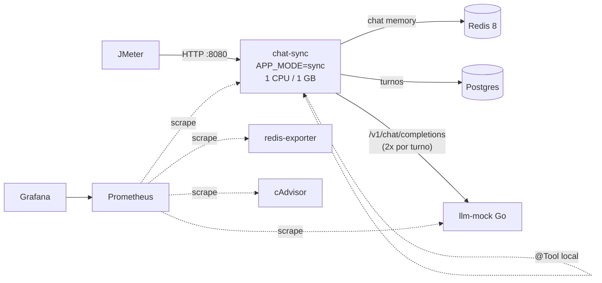
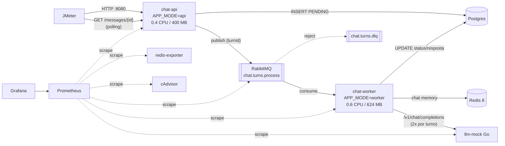

# BackendLLM — Design

- **Data:** 2026-09-26
- **Status:** aprovado em brainstorming, aguardando revisão do spec
- **Escopo deste ciclo:** backend (mock LLM em Go + app Spring Boot) e observabilidade. Os planos JMeter (smoke, stress, spike) ficam para um spec separado.

## 1. Objetivo

Construir um alvo realista para estudar técnicas de teste de performance com JMeter (smoke, stress, spike) e observar **gargalos reais** sob carga, comparando duas arquiteturas da mesma aplicação de "chat com IA":

1. **Variante `sync`** — Spring Boot + Spring AI + Virtual Threads processando a conversa dentro da requisição HTTP.
2. **Variante `queue`** — a mesma stack com RabbitMQ na frente: API aceita e enfileira, worker processa.

Não há LLM real: um mock em Go, compatível com a API da OpenAI, simula latência de 2–5s por chamada.

## 2. Restrições

- Todo o backend fica em `BackendLLM/`, orquestrado por **um único** `docker-compose.yml`.
- A aplicação Java sempre roda em Docker durante os testes.
- **Orçamento Java: 1 CPU e 1 GB no total por variante.** Na variante `queue`, API + worker dividem esse orçamento (divisão livre, configurável).
- Infraestrutura (Postgres, Redis, RabbitMQ, mock LLM, Prometheus, Grafana, exporters) não tem limite de recursos e não conta no orçamento.
- Cada mensagem do usuário gera exatamente: **1 chamada LLM → 1 tool call → 1 chamada LLM** (processando o resultado da tool).
- Redis = memória de curto prazo do LLM (via starter do Spring AI). Postgres = registro permanente da conversa.
- As escritas no Postgres e o contrato de leitura são **idênticos** nas duas variantes, para que um mesmo plano JMeter sirva às duas.

## 3. Arquitetura

### 3.1 Variante `sync`



### 3.2 Variante `queue`



### 3.3 Fluxo de um turno (comum às duas variantes)

```mermaid
sequenceDiagram
    participant P as ConversationProcessor
    participant DB as Postgres
    participant M as Redis (ChatMemory)
    participant L as llm-mock
    P->>DB: UPDATE status=PROCESSING WHERE status=PENDING
    P->>M: carrega janela (últimas 20 mensagens)
    P->>L: chat/completions (tools declaradas)
    L-->>P: tool_calls (2–5s)
    P->>P: executa @Tool
    P->>L: chat/completions (com tool result)
    L-->>P: resposta final (2–5s)
    P->>M: grava user + assistant
    P->>DB: UPDATE status=DONE, assistant_content
```

## 4. Layout do repositório

```
BackendLLM/
├── docker-compose.yml
├── .env                      # limites de recursos e parâmetros de ajuste
├── README.md                 # como rodar, URLs, diagramas das duas arquiteturas
├── llm-mock/                 # Go
├── chat-app/                 # Spring Boot (Maven, Java 25), um jar, APP_MODE=sync|api|worker
└── observability/
    ├── prometheus/prometheus.yml
    └── grafana/
        ├── provisioning/     # datasource + dashboard providers
        └── dashboards/*.json
```

## 5. Docker Compose

| Serviço | Profile | Recursos (padrão) | Porta host |
|---|---|---|---|
| `postgres` (17) | sempre | livre | 5432 |
| `redis` (`redis:8.6`, inclui RedisJSON + Query Engine) | sempre | livre | 6379 |
| `redis-exporter` | sempre | livre | 9121 |
| `llm-mock` | sempre | livre | 9000 |
| `prometheus` | sempre | livre | 9090 |
| `grafana` | sempre | livre | 3000 |
| `cadvisor` | sempre | livre | 8088 |
| `chat-sync` (`APP_MODE=sync`) | `sync` | 1 CPU / 1 GB | 8080 |
| `rabbitmq` (management + prometheus plugin) | `queue` | livre | 5672, 15672, 15692 |
| `chat-api` (`APP_MODE=api`) | `queue` | 0.4 CPU / 400 MB | 8080 |
| `chat-worker` (`APP_MODE=worker`) | `queue` | 0.6 CPU / 624 MB | — (só rede interna) |

- Uso: `docker compose --profile sync up` **ou** `docker compose --profile queue up`. Uma variante por vez; ambas expõem a API em `:8080`.
- Limites vêm do `.env` (`SYNC_CPUS`, `SYNC_MEM`, `API_CPUS`, `API_MEM`, `WORKER_CPUS`, `WORKER_MEM`). Invariante: `API_* + WORKER_* ≤ 1 CPU / 1 GB`.
- JVM com `-XX:MaxRAMPercentage=75` para respeitar o limite do container.
- Healthchecks em todos os serviços; apps Java usam `depends_on: condition: service_healthy`.

## 6. llm-mock (Go)

**Stack:** `net/http` da stdlib + `prometheus/client_golang`.

**Endpoint:** `POST /v1/chat/completions`, formato OpenAI, sem streaming. Também `GET /healthz` e `GET /metrics`.

**Decisão da resposta:**

| Condição da requisição | Resposta | `finish_reason` |
|---|---|---|
| Tem `tools` e a última mensagem **não** é `role: tool` | `tool_calls` para a **primeira tool declarada**, com argumentos gerados a partir do JSON Schema dela | `tool_calls` |
| Última mensagem é `role: tool` | Texto final incorporando o conteúdo do tool result | `stop` |
| Sem `tools` | Texto simples | `stop` |

Geração de argumentos pelo schema: `string` → trecho da última mensagem do usuário; `number`/`integer` → `1`; `boolean` → `true`. O mock não conhece nomes de tools Java.

**Configuração (env):**

| Variável | Padrão | Efeito |
|---|---|---|
| `MIN_DELAY_MS` | 2000 | Delay mínimo por chamada |
| `MAX_DELAY_MS` | 5000 | Delay máximo (uniforme entre min e max) |
| `ERROR_RATE` | 0.0 | Fração de chamadas que retornam 500 ou 429 |
| `PORT` | 9000 | Porta HTTP |

- O sleep respeita o cancelamento do `context` da requisição.
- Uma goroutine por requisição, sem limite: o mock nunca deve ser o gargalo.
- `usage` com contagens fictícias de tokens.

**Métricas:** `llm_mock_requests_total{type="tool_call|final|text|error"}`, `llm_mock_inflight_requests` (gauge), `llm_mock_delay_seconds` (histograma).

## 7. chat-app (Spring Boot)

**Stack:** Java 25, Spring Boot 4.1.1, Spring AI 2.0.1 (`spring-ai-starter-model-openai` apontando para o mock — usa o SDK oficial `openai-java`/OkHttp; `spring-ai-starter-model-chat-memory-repository-redis`), `JdbcClient` (spring-boot-starter-jdbc) + Flyway, Spring AMQP, Actuator + Micrometer Prometheus.

> Persistência com `JdbcClient` em vez de JPA: cada update é um SQL explícito com auto-commit, o que torna visível (e garantido) que nenhuma conexão fica presa durante as chamadas ao LLM, e evita queries ocultas que distorceriam as medições.

### 7.1 Modos (`APP_MODE` → Spring profile)

| Modo | Beans ativos |
|---|---|
| `sync` | Controllers; `POST` de mensagem chama `ConversationProcessor` inline |
| `api` | Controllers; `POST` de mensagem publica no RabbitMQ |
| `worker` | `@RabbitListener` que chama `ConversationProcessor`; apenas Actuator exposto |

Estratégia de envio do turno isolada atrás de uma interface (`TurnDispatcher`: `InlineTurnDispatcher` no `sync`, `RabbitTurnDispatcher` no `api`), selecionada por `@Profile`.

`spring.threads.virtual.enabled=true` em todos os modos.

### 7.2 Modelo de dados (Flyway)

```sql
conversations (
  id          uuid PRIMARY KEY,
  created_at  timestamptz NOT NULL
)

chat_turns (
  id                 uuid PRIMARY KEY,
  conversation_id    uuid NOT NULL REFERENCES conversations(id),
  user_content       text NOT NULL,
  assistant_content  text,
  status             varchar(16) NOT NULL,  -- PENDING | PROCESSING | DONE | FAILED
  error              text,
  created_at         timestamptz NOT NULL,
  started_at         timestamptz,
  completed_at       timestamptz
)
-- índice em chat_turns(conversation_id, created_at)
```

`started_at - created_at` = espera (fila); `completed_at - started_at` = processamento.

### 7.3 API HTTP (idêntica nos modos `sync` e `api`)

| Método e rota | Corpo | Resposta |
|---|---|---|
| `POST /conversations` | — | `201 {conversationId}` |
| `POST /conversations/{id}/messages` | `{content}` | `sync`: `200 {messageId, conversationId, status, response, error}`; `api`: `202 {messageId, conversationId, status: PENDING}` |
| `GET /messages/{id}` | — | `200 {messageId, conversationId, status, response, error, createdAt, startedAt, completedAt}` (lido do Postgres) |
| `GET /conversations/{id}/messages` | — | `200` lista de turnos da conversa, em ordem cronológica (lido do Postgres) |

`messageId` = `chat_turns.id`.

**Fluxo JMeter pretendido (mesmo plano para as duas variantes):** cria conversa → para cada mensagem: `POST` → extrai `messageId`/`status` → While (`status` ∉ {DONE, FAILED}) faz polling em `GET /messages/{id}`. No `sync` o loop sai imediatamente.

### 7.4 ConversationProcessor.process(turnId)

1. Em transação curta: `UPDATE chat_turns SET status='PROCESSING', started_at=now() WHERE id=? AND status='PENDING'`. Se 0 linhas afetadas, retorna sem fazer nada (idempotência contra reentrega).
2. Fora de qualquer transação: `ChatClient` com `MessageChatMemoryAdvisor` (conversationId) e a tool registrada → LLM → tool → LLM.
3. Em transação curta: `status='DONE'`, `assistant_content`, `completed_at`. Em exceção do passo 2: `status='FAILED'`, `error`, `completed_at`.

**Regra crítica:** nenhuma conexão do HikariCP fica retida durante as chamadas ao LLM. `spring.jpa.open-in-view=false`. Isso deve estar comentado no código, pois é o erro clássico que limitaria o sistema a `pool_size / duração_do_turno` req/s.

No modo `sync`, o controller faz o `INSERT PENDING` (passo 0) e chama `process` na mesma thread; o resultado é relido do Postgres para montar a resposta.

### 7.5 Tool

Uma `@Tool` Java local, rápida e determinística — `consultarPrevisaoTempo(cidade)` retornando dados fictícios. Não adiciona latência própria; o custo dela no fluxo é o segundo round-trip ao LLM.

### 7.6 Memória de curto prazo (Redis)

- `RedisChatMemoryRepository` do starter `spring-ai-starter-model-chat-memory-repository-redis` (cliente Jedis, requer RedisJSON + Query Engine → `redis:8`).
- Envolvido por `MessageWindowChatMemory.builder().maxMessages(20)`.
- Propriedades: `spring.ai.chat.memory.repository.redis.host/port`, `key-prefix=chat-memory:`, `time-to-live=1h`, `initialize-schema=true`.
- Expirado o TTL, o contexto de curto prazo se perde; o histórico permanece no Postgres. Não há reidratação do Redis a partir do Postgres.
- Como o repositório usa Jedis próprio, o tráfego Redis não aparece nas métricas Lettuce do Micrometer; o `redis-exporter` cobre esse lado.
- O starter cria um `RedisClient` com o pool padrão do Jedis (**8 conexões**), com `@ConditionalOnMissingBean`. A app declara o próprio `RedisClient` com `REDIS_POOL_MAX` (padrão 8, igual ao do Jedis) para que esse gargalo possa ser observado e ajustado.

### 7.7 Cliente LLM

- `spring.ai.openai.base-url=http://llm-mock:9000/v1` (o Spring AI usa a URL como está; o mock atende com e sem `/v1`), api-key fictícia.
- `spring.ai.openai.timeout=30s`.
- Retry **desligado por padrão** nas duas camadas: `spring.ai.retry.max-attempts=1` (Spring AI) e `spring.ai.openai.max-retries=0` (SDK openai-java). Configurável por env.

## 8. Modo fila (RabbitMQ)

**Topologia** (declarada pela app):

- Exchange `chat.turns` (direct) → fila durável `chat.turns.process`.
- `chat.turns.process` tem dead-letter para a fila `chat.turns.dlq`.
- Sem `x-max-length` (backlog ilimitado, para observar crescimento).

**API (`api`):** `INSERT PENDING` (commit) → publica o `turnId` (corpo texto, UUID) → `202`. Falha no publish → turno `FAILED` e resposta `503`. Sem outbox; a janela entre commit e publish é limitação conhecida.

**Worker (`worker`):**

- `@RabbitListener` com executor de virtual threads.
- `WORKER_CONCURRENCY` (padrão 50) consumidores, `prefetch=1` → no máximo 50 turnos simultâneos. Capacidade estimada ≈ 50 / 7s ≈ 7 turnos/s.
- Ack automático após o processamento. Erros de negócio/LLM são tratados pelo processor (turno `FAILED`) e a mensagem é confirmada. Erro de infraestrutura antes de conseguir marcar o turno → reject sem requeue → DLQ.
- Limitação conhecida: worker morto no meio do processamento deixa o turno em `PROCESSING` (sem reaper).

## 9. Tratamento de erros

- Respostas de erro em `ProblemDetail` (RFC 9457).
- `400`: `content` vazio ou com mais de 4000 caracteres.
- `404`: conversa ou mensagem inexistente.
- `503`: falha ao publicar no RabbitMQ (modo `api`).
- Falha/timeout do LLM → turno `FAILED` com erro gravado. No `sync` o `POST` responde `200` com `status: FAILED`, para que assertions JMeter baseadas no campo `status` contem erros igualmente nas duas variantes.
- `server.shutdown=graceful`.

## 10. Observabilidade

**Prometheus** (`scrape_interval: 5s`): `chat-sync`/`chat-api`/`chat-worker` em `/actuator/prometheus`, `llm-mock:9000/metrics`, `rabbitmq:15692`, `redis-exporter:9121`, `cadvisor`.

**Métricas da app:**

- Nativas: `http_server_requests`, `hikaricp_connections_*`, JVM (heap, GC, threads), observações do Spring AI (chamadas `gen_ai`, tool calls, tokens).
- Customizadas: `chat_turn_processing_seconds{mode,outcome}`, `chat_turn_queue_wait_seconds{mode}`, `chat_turns_total{mode,outcome}`, `chat_turns_inflight{mode}` (gauge).

**Dashboards Grafana** (provisionados, JSON versionado):

1. **Visão geral** — RPS, latência HTTP p50/p95/p99, taxa DONE/FAILED, turnos em andamento, chamadas LLM em andamento.
2. **Recursos** — CPU por container com throttling (cAdvisor), memória vs. limite, heap/GC, HikariCP.
3. **Fila** — profundidade, publish/deliver/ack, unacked, DLQ, tempo de espera na fila.

## 11. Testes

- **Go:** unitários para decisão de resposta, geração de argumentos pelo schema e faixa de delay; `httptest` validando o formato OpenAI.
- **Java unitários:** `ConversationProcessor` (transições de status, idempotência, falha do LLM → `FAILED`); controllers com `@WebMvcTest`.
- **Java integração (Testcontainers):** Postgres, `redis:8`, RabbitMQ e o llm-mock construído a partir do seu Dockerfile (`MIN_DELAY_MS=MAX_DELAY_MS=10`). Cobre o fluxo LLM → tool → LLM nos modos `sync` e `api`+`worker`, incluindo memória entre turnos.

## 12. README (`BackendLLM/README.md`)

- Diagramas Mermaid das duas arquiteturas (seções 3.1 e 3.2) e do fluxo de um turno (3.3).
- Como subir cada variante, variáveis do `.env` e o invariante de orçamento.
- URLs: API `:8080`, Grafana `:3000`, Prometheus `:9090`, RabbitMQ `:15672`, cAdvisor `:8088`.
- Roteiro `curl` para validação manual (criar conversa, enviar mensagem, consultar status e histórico).

## 13. Fora de escopo

- Planos JMeter (próximo spec), incluindo avaliar o Backend Listener do JMeter para o Grafana.
- Streaming de respostas, autenticação.
- Outbox pattern, reaper de turnos órfãos, `x-max-length` na fila.
- Ordenação de mensagens concorrentes na mesma conversa.
- Reidratação da memória Redis a partir do Postgres.
- Exporters de Postgres.
